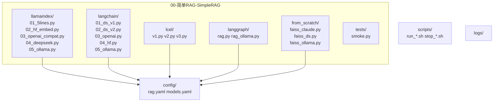

### 目的與範圍

本計劃針對 `00-简单RAG-SimpleRAG/` 的示例代碼進行「凱蘇式」迭代（Kaizen），在保持入門友好與可運行的前提下，吸收其它模組的優點（01/02/03/04/05/06/07/08/09/10），形成一套可持續演進、可二次開發、可觀測與可測的教學—工程雙用基座。

- 交付物：
  - 統一的結構與配置（`.env.example`、`config/*.yaml`、`scripts/`、`logs/`）
  - 每個檔案的改進清單與落地步驟（含代碼引用）
  - Mermaid 流程圖與「學—用—評—改」閉環

---

### 全景與目標

```mermaid
flowchart TD
  A[01-數據導入] --> B[02-文本切塊]
  B --> C[03-向量嵌入]
  C --> D[04-向量存儲]
  D --> E[00-簡單RAG：入門示例]
  E --> F[06-索引優化(句窗/父子/雙層/多表示)]
  E --> G[07-檢索後處理(重排/壓縮/校正)]
  E --> H[08-響應生成(模板/JSON/函式調用)]
  E --> I[09-系統評估(RAGAS/TruLens/DeepEval)]
  E --> J[10-高級編排(Agentic/Contextual/多模態)]
```

- 第一目標：保留「5 行可跑」體驗，增強可配置、可觀測。
- 第二目標：為後續進階（6/7/8/9/10）預埋鉤子與接口。

---

## 檔案逐一解析與改進計劃（含代碼引用）

> 說明：以下每節均包含
> - 現狀與重點
> - 代碼定位（片段引用）
> - 問題或風險
> - Kaizen 建議（最小改動 → 進階擴展）

### 1) 01_01_LlamaIndex_5行代码.py

- 現狀：5 步完成讀取→索引→問答，最小可跑樣例。
- 代碼定位：
```12:21:00-简单RAG-SimpleRAG/01_01_LlamaIndex_5行代码.py
from llama_index.core import VectorStoreIndex, SimpleDirectoryReader 
documents = SimpleDirectoryReader(input_files=["90-文档-Data/黑悟空/设定.txt"]).load_data() 
index = VectorStoreIndex.from_documents(documents)
query_engine = index.as_query_engine()
print(query_engine.query("黑神话悟空中有哪些战斗工具?"))
```
- 問題：
  - 無參數化（`similarity_top_k`、分塊/嵌入/LLM 皆默認）。
  - 無可觀測（無 `source_nodes`、無 `logs/`）。
- Kaizen：
  - 最小：加 `response.source_nodes` 打印；`as_query_engine(similarity_top_k=K)`；結果落檔到 `logs/`。
  - 進階：引入 `node_postprocessors`（如窗口替換）、配置化（`.env/.yaml`）。

### 2) 01_02_LlamaIndex_更换嵌入模型.py

- 現狀：切換 HuggingFace 嵌入模型。
- 代碼定位：
```8:18:00-简单RAG-SimpleRAG/01_02_LlamaIndex_更换嵌入模型.py
embed_model = HuggingFaceEmbedding(
    model_name="BAAI/bge-small-zh"
)
documents = SimpleDirectoryReader(input_files=["90-文档-Data/黑悟空/设定.txt"]).load_data() 
index = VectorStoreIndex.from_documents(
    documents,
    embed_model=embed_model
)
```
- 問題：未提供歸一化、設備與緩存策略；無評估。
- Kaizen：
  - 最小：顯式設定 `normalize_embeddings`；提供 CPU/GPU 切換。
  - 進階：加入 09 模組評估（RAGAS 的 Context Precision/Recall）。

### 3) 01_03_LlamaIndex_更换兼容OPENAI API的模型

- 現狀：演示自定義 BaseURL + Key 接入兼容 OpenAI API。
- 代碼定位：
```19:23:00-简单RAG-SimpleRAG/01_03_LlamaIndex_更换兼容OPENAI API的模型
Settings.llm = OpenAI(
    model=llm_model_name,
    api_key=custom_api_key,
    api_base=custom_api_base_url,
)
```
```53:61:00-简单RAG-SimpleRAG/01_03_LlamaIndex_更换兼容OPENAI API的模型
print("正在构建索引...")
index = VectorStoreIndex.from_documents(documents)
print("索引构建完成。")
query_engine = index.as_query_engine()
print("问答引擎已创建。")
```
- 問題：Key 泄漏風險、異常未落盤；無超時/重試策略。
- Kaizen：
  - 最小：移至 `.env`，加 `try/except` 與 `logs/`。
  - 進階：加入 `backoff` 重試，與 09 評估串接。

### 4) 01_03_LlamaIndex_更换生成模型.py

- 現狀：更換 LLM 與嵌入（DeepSeek/OpenAI/HF 可替換）。
- 代碼定位：
```21:27:00-简单RAG-SimpleRAG/01_03_LlamaIndex_更换生成模型.py
llm = DeepSeek(
    model="deepseek-reasoner",
    api_key=os.getenv("DEEPSEEK_API_KEY")
)
```
```30:33:00-简单RAG-SimpleRAG/01_03_LlamaIndex_更换生成模型.py
query_engine = index.as_query_engine(
    llm=llm
)
```
- Kaizen：支持多模型權重/成本觀測（模型名、耗時、Token）。

### 5) 01_04_LlamaIndex_5行代码_DeepSeek.py

- 代碼定位：
```35:38:00-简单RAG-SimpleRAG/01_04_LlamaIndex_5行代码_DeepSeek.py
query_engine = index.as_query_engine(
    llm=llm  # 设置生成模型
)
```
- Kaizen：與 01_01 同步做「可觀測/可配置」。

### 6) 01_05_LlamaIndex_5行代码_Ollama.py

- 代碼定位：
```35:38:00-简单RAG-SimpleRAG/01_05_LlamaIndex_5行代码_Ollama.py
llm = Ollama(
    model=os.getenv("OLLAMA_MODEL"),
    request_timeout=300.0
)
```
```44:52:00-简单RAG-SimpleRAG/01_05_LlamaIndex_5行代码_Ollama.py
index = VectorStoreIndex.from_documents(
    documents,
    embed_model=embed_model
)
query_engine = index.as_query_engine(
    llm=llm
)
```
- Kaizen：增補「本地模型資源檢查」「超時與重試」。

### 7) 02_01_LangChain_DeepSeek_Model_v1.py

- 現狀：LangChain 基礎 RAG，DeepSeek 作生成。
- 代碼定位：
```24:28:00-简单RAG-SimpleRAG/02_01_LangChain_DeepSeek_Model_v1.py
embeddings = HuggingFaceEmbeddings(
    model_name="BAAI/bge-small-zh-v1.5",
    model_kwargs={'device': 'cpu'},
    encode_kwargs={'normalize_embeddings': True}
)
```
```56:63:00-简单RAG-SimpleRAG/02_01_LangChain_DeepSeek_Model_v1.py
llm = ChatDeepSeek(
    model="deepseek-chat",
    temperature=0.7,
    max_tokens=2048,
    api_key=os.getenv("DEEPSEEK_API_KEY")
)
answer = llm.invoke(prompt.format(question=question, context=docs_content))
```
- Kaizen：
  - 最小：將 `k/top_p/溫度` 入 `config/`；加日誌。
  - 進階：加上 08 的 JSON 輸出控制，便於前端解析。

### 8) 02_02_LangChain_DeepSeek_Model_v2.py

- 代碼定位：
```49:49:00-简单RAG-SimpleRAG/02_02_LangChain_DeepSeek_Model_v2.py
llm = ChatDeepSeek(model="deepseek-chat", api_key=os.getenv("DEEPSEEK_API_KEY"))
```
```53:66:00-简单RAG-SimpleRAG/02_02_LangChain_DeepSeek_Model_v2.py
chain = (
    {
        "context": retriever | (lambda docs: "\n\n".join(doc.page_content for doc in docs)),
        "question": RunnablePassthrough()
    }
    | prompt
    | llm
    | StrOutputParser()
)
```
- Kaizen：保留「分階段輸出」的 Debug 代碼到 `logs/`。

### 9) 02_03_LangChain_OpenAI_Model.py

- 代碼定位：
```39:43:00-简单RAG-SimpleRAG/02_03_LangChain_OpenAI_Model.py
from langchain_openai import ChatOpenAI
llm = ChatOpenAI(model="gpt-3.5-turbo")
answer = llm.invoke(prompt.format(question=question, context=docs_content))
```
- Kaizen：加「本地/雲」二選一開關；記錄成本指標。

### 10) 02_04_LangChain_HuggingFace_Model.py

- 代碼定位：
```54:75:00-简单RAG-SimpleRAG/02_04_LangChain_HuggingFace_Model.py
model_name = "Qwen/Qwen2.5-1.5B"
tokenizer = AutoTokenizer.from_pretrained(model_name, trust_remote_code=True)
model = AutoModelForCausalLM.from_pretrained(model_name, trust_remote_code=True)
pipe = pipeline("text-generation", model=model, tokenizer=tokenizer, ...)
llm = HuggingFacePipeline(pipeline=pipe)
answer = llm.invoke(prompt.format(question=question, context=docs_content))
```
- Kaizen：提供「CPU/GPU 自動」與安全限流。

### 11) 02_05_LangChain_Ollama_Model.py

- 代碼定位：
```70:73:00-简单RAG-SimpleRAG/02_05_LangChain_Ollama_Model.py
from langchain_ollama import ChatOllama # pip install langchain-ollama
llm = ChatOllama(model=os.getenv("OLLAMA_MODEL"))
answer = llm.invoke(prompt.format(question=question, context=docs_content))
```
- Kaizen：模型存在性檢查；啟動提示。

### 12) 03_LangChain_LCEL_RAG_v1.py

- 代碼定位：
```49:56:00-简单RAG-SimpleRAG/03_LangChain_LCEL_RAG_v1.py
chain = (
  {"context": retriever | (lambda docs: "\n\n".join(doc.page_content for doc in docs)),
   "question": RunnablePassthrough()}    
  | prompt | llm | StrOutputParser()
)
```
- Kaizen：保留 LCEL 教學性，新增「中間節點輸出」到 `logs/`。

### 13) 03_LangChain_LCEL_RAG_v2.py

- 代碼定位：
```72:90:00-简单RAG-SimpleRAG/03_LangChain_LCEL_RAG_v2.py
retriever_output = retriever.invoke(question)
... prompt_output = prompt.invoke({"context": context, "question": question})
... final_output = StrOutputParser().invoke(llm_output)
```
- Kaizen：把這段做成 `debug=True` 的可開關詳列。

### 14) 03_LangChain_LCEL_RAG_v3.py

- 代碼定位：
```47:60:00-简单RAG-SimpleRAG/03_LangChain_LCEL_RAG_v3.py
chain = ({"context": retriever | (lambda docs: "\n\n".join(...)),
          "question": RunnablePassthrough()}
         | prompt | llm | StrOutputParser())
```
- Kaizen：DeepSeek 融合與 08 的結構化輸出。

### 15) 04_LangGraph_RAG.py / 04_LangGraph_RAG_Ollama.py

- 代碼定位：
```58:66:00-简单RAG-SimpleRAG/04_LangGraph_RAG.py
graph = (
  StateGraph(State)
  .add_sequence([retrieve, generate])
  .add_edge(START, "retrieve")
  .compile())
```
```51:56:00-简单RAG-SimpleRAG/04_LangGraph_RAG_Ollama.py
llm = ChatOllama(model=os.getenv("OLLAMA_MODEL"))
response = llm.invoke(messages)
return {"answer": response.content}
```
- Kaizen：
  - 最小：導入 `MermaidDrawMethod.PYPPETEER` 輸出流程圖 PNG（參考 10/04-AgenticRAG）。
  - 進階：加節點「評分/改寫」，向 10 的 AdaptiveRAG 靠攏。

### 16) 05_RAG_from_Scratch_*.py

- 代碼定位（Claude 版）：
```26:33:00-简单RAG-SimpleRAG/05_RAG_from_Scratch_Claude.py
dimension = doc_embeddings.shape[1]
index = faiss.IndexFlatL2(dimension)
index.add(doc_embeddings.astype('float32'))
```
```55:65:00-简单RAG-SimpleRAG/05_RAG_from_Scratch_Claude.py
claude = Anthropic(api_key=os.getenv("CLAUDE_API_KEY"))
response = claude.messages.create(
  model="claude-3-5-sonnet-20241022", messages=[{"role":"user","content": prompt}],
  max_tokens=1024)
```
- 代碼定位（DeepSeek 版）：
```54:69:00-简单RAG-SimpleRAG/05_RAG_from_Scratch_DeepSeek.py
client = OpenAI(api_key=os.getenv("DEEPSEEK_API_KEY"), base_url="https://api.deepseek.com/v1")
response = client.chat.completions.create(model="deepseek-chat", messages=[{"role":"user","content": prompt}], max_tokens=1024)
```
- 代碼定位（Ollama 版）：
```55:64:00-简单RAG-SimpleRAG/05_RAG_from_Scratch_Ollama.py
from ollama import chat
response = chat(model=os.getenv("OLLAMA_MODEL"), messages=[{"role":"user","content": prompt}])
```
- Kaizen：
  - 最小：抽象「檢索 + 提示模板 + 生成」為函式，便於測試。
  - 進階：加入 07 重排（RRF/CrossEncoder）與 08 JSON 輸出。

### 17) 99_Testing.py

- 代碼定位：
```12:21:00-简单RAG-SimpleRAG/99_Testing.py
from llama_index.core import VectorStoreIndex, SimpleDirectoryReader 
documents = SimpleDirectoryReader(input_files=["90-文档-Data/黑悟空/设定.txt"]).load_data() 
index = VectorStoreIndex.from_documents(documents)
query_engine = index.as_query_engine()
print(query_engine.query("黑神话悟空中有哪些战斗工具?"))
```
- Kaizen：替換為統一的「最小可跑測試」，輸出到 `logs/`；作 Smoke Test。

---

## 吸收其它模組的「優點」到 00 的落地方案

- 05 檢索前處理（SelfQuery / MultiQuery / HyDE / Text2SQL/2Cypher）
  - 在 LangChain v2/v3 與 LangGraph 版中，新增可選節點：`self_query_node`、`multi_query_node`、`hyde_node`、`text2sql_node`。
- 06 索引優化（句窗/父子/PrevNext/AutoMerging/雙層/多表示）
  - 在 LlamaIndex 範例加入 `SentenceWindowNodeParser`、`ParentDocumentRetriever`；在 from-scratch 版加入「雙層索引」示例連結。
- 07 檢索後處理（RRF/CrossEncoder/ColBERT/RankLLM + ContextualCompression/LLMLingua）
  - 在 LCEL/Graph 範例中於檢索後追加 `rerank_node`、`compress_node`；初期先提供 Cohere/CrossEncoder 與 ContextualCompression。
- 08 響應生成（模板化、JSON/Pydantic、Function Calling）
  - 在所有最終生成前統一「輸出控制」：`JsonOutputParser` 或 Pydantic；部分案例加入 `bind_tools`。
- 09 評估（RAGAS/TruLens/DeepEval/LlamaIndex Eval）
  - 在所有示例加「結果記錄器」：寫 `logs/eval.jsonl`（字段：question/context/answer/ref/source_nodes/model/timing）；用 09 腳本一鍵評估。
- 10 編排（Agentic/Adaptive/多模態/Contextual）
  - 以 LangGraph 版為基座，加「文檔評分、改寫、網搜」；多模態則以 Weaviate `near_image` 作工具整合。

---

## 目錄重構與工程規範（保持 ≤200 行/檔）



規範落地：
- 參數統一讀取 `config/*.yaml`，敏感資訊走 `.env`。
- 執行與除錯統一使用 `scripts/*.sh`，輸出到 `logs/`。
- 每檔 ≤200 行，按功能拆分；避免循環依賴；關鍵變數/函式名語義化。

---

## 迭代路線圖（Kaizen Milestones）

- M0 基線（1 天）
  - 補 `.env.example`、`config/models.yaml`、`config/rag.yaml`
  - 為 5 行示例加 `similarity_top_k`、`source_nodes`、落盤 `logs/`。
- M1 可觀測（1 天）
  - 全部示例接入結果記錄器（`logs/eval.jsonl`）。
  - 補 `scripts/run_*.sh` 和 `scripts/stop_*.sh`。
- M2 檢索強化（2 天）
  - 加入 07 的 `CrossEncoder` 與 `ContextualCompression` 節點。
  - LlamaIndex 範例加入 `SentenceWindow` 與 `Parent-Child`。
- M3 生成控制（1 天）
  - 最終回答統一 JSON/Pydantic；必要時 `function calling`。
- M4 評估閉環（1 天）
  - RAGAS/TruLens/DeepEval 一鍵腳本（讀取 `logs/eval.jsonl`）。
- M5 編排與多模態（2 天）
  - LangGraph 版引入「評分/改寫/網搜」，可選支路。
  - 多模態 Weaviate 工具接入。

---

## 任務清單（逐檔細化，摘錄）

- 01_01_5行：加入 `similarity_top_k`、`source_nodes`、`logs/response.json`；配置化。
- 01_02_嵌入：加入 `normalize_embeddings`；CPU/GPU 切換；RAGAS 兩項指標。
- 01_03_OpenAI兼容：移除硬編碼 Key；加 backoff 重試；錯誤落盤。
- 02_01~05_LangChain：抽公共「檢索→提示→生成」函式；最終 JSON 輸出；成本統計。
- 03_v1~v3_LCEL：保留教學 Debug；提供 `debug=True` 開關；中間態落盤。
- 04_LangGraph_*：導出流程圖 PNG；加入「評分/改寫」支路。
- 05_from_scratch_*：抽象 FAISS 與 Prompt；可選重排；增加 Smoke Test。
- 99_Testing：改為統一 Smoke Test，跑通所有基線檔案。

---

## 驗收與評估

- 功能：所有示例可在 `.env` 配好後一鍵啟動（scripts）並產生 `logs/eval.jsonl`。
- 質量：RAGAS—Faithfulness≥0.6、Answer Relevancy≥0.6（基線）；TruLens—Groundedness ≥ 中等。
- 維運：每檔 ≤200 行、無循環依賴、關鍵參數可配置、錯誤有落盤。

---

## 後續擴展（與 10 對齊）

- 把 LangGraph 版升級為「最小 Adaptive RAG 子圖」（路由/評分/改寫/重試）。
- 接入多模態工具（near_image/near_text + GPT-4V 描述 + DALL·E-3 生圖）。
- 評估儀表板（TruLens 可視化 + 週期報告）。


