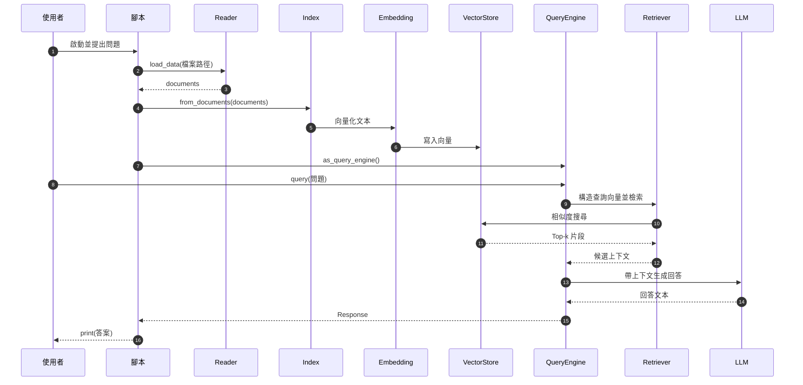
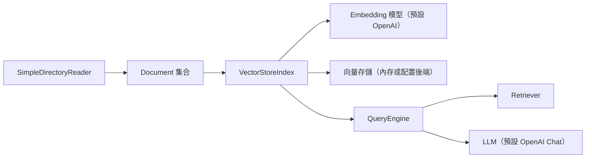

## 總覽

這份文件對應代碼檔 `00-简单RAG-SimpleRAG/01_01_LlamaIndex_5行代码.py`。它展示了一個極簡 RAG（檢索增強生成）流程：從本地檔案讀取文本、建立向量索引、基於問題進行相似度檢索，並由 LLM 生成答案。

---

## 流程圖（Overview Flow）

```mermaid
flowchart TD
  A["啟動腳本"] --> B["讀取環境變數 OPENAI_API_KEY"]
  B --> C["SimpleDirectoryReader 載入檔案：90-文档-Data/黑悟空/设定.txt"]
  C --> D["得到 Documents"]
  D --> E["VectorStoreIndex.from_documents(documents) 建立索引"]
  E --> F["index.as_query_engine() 建立 QueryEngine"]
  F --> G["query(\"黑神話悟空中有哪些戰鬥工具？\")"]
  G --> H["檢索：相似度搜尋 Top-k"]
  H --> I["生成：LLM 基於檢索片段生成答案"]
  I --> J["print(...) 輸出結果"]
```

---

## 時序圖（Sequence）



---

## 依賴關係圖（Modules & Dependencies）



---

## 分步講解（逐行/逐模組）

對應代碼：`00-简单RAG-SimpleRAG/01_01_LlamaIndex_5行代码.py`

```python
from llama_index.core import VectorStoreIndex, SimpleDirectoryReader
documents = SimpleDirectoryReader(input_files=["90-文档-Data/黑悟空/设定.txt"]).load_data()
index = VectorStoreIndex.from_documents(documents)
query_engine = index.as_query_engine()
print(query_engine.query("黑神话悟空中有哪些战斗工具?"))
```

- 匯入（Import）
  - `VectorStoreIndex`：向量索引構建器，負責將文本分片、向量化並管理檢索。
  - `SimpleDirectoryReader`：檔案讀取器，將本地檔案轉為 `Document` 集合。

- 載入資料（Load Data）
  - `SimpleDirectoryReader(...).load_data()` 將 `90-文档-Data/黑悟空/设定.txt` 讀成 `Document` 列表。
  - RAG 背景：`Document` 是帶文本與（可選）元資料的基本單位。

- 建立索引（Build Index）
  - `VectorStoreIndex.from_documents(documents)`：對文本分塊、向量化，並寫入向量存儲（默認內存或已配置後端）。
  - 背景：向量化將文字映射到高維空間，以支持相似度檢索。

- 問答引擎（Query Engine）
  - `index.as_query_engine()`：封裝 Retriever（檢索 top-k 上下文）與回應生成器（將上下文 + 問題交由 LLM 生成）。

- 查詢與輸出（Query & Print）
  - `query_engine.query(...)`：
    1) 將問題向量化並在向量庫檢索相關片段；
    2) 將片段與問題一同交給 LLM 生成答案；
    3) 回傳文字結果。
  - `print(...)`：將答案輸出到終端。

> 提示：預設需要環境變數 `OPENAI_API_KEY` 以使用 OpenAI 服務；如無法使用，可改用本專案中其他「平替方案」程式。

---

## 關鍵點總結

- **資料載入**：`SimpleDirectoryReader(...).load_data()` 產生 `Document` 集合。
- **索引構建**：`VectorStoreIndex.from_documents(documents)` 完成切片、向量化與寫入向量庫。
- **查詢引擎**：`index.as_query_engine()` 提供一站式的檢索 + 生成能力。
- **RAG 主線**：讀取文本 → 建索引（向量化） → 相似度檢索（top-k） → 基於上下文生成 → 輸出。
- **前置條件**：需設定 `OPENAI_API_KEY`；否則請改用其他無需該金鑰的示例。


