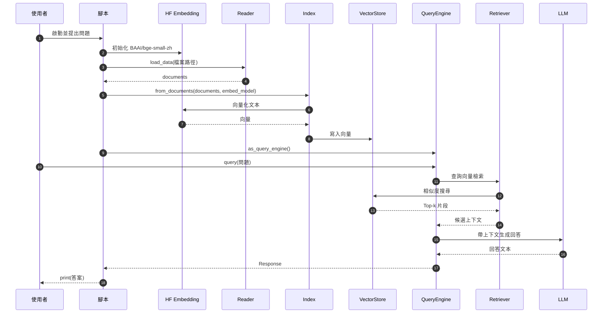
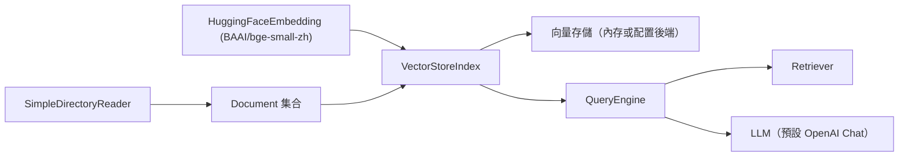

## 總覽

本文件對應代碼檔 `00-简单RAG-SimpleRAG/01_02_LlamaIndex_更换嵌入模型.py`。在保持最小 RAG 流程（讀取→建索引→查詢→生成）的同時，將嵌入模型更換為 HuggingFace 的 `BAAI/bge-small-zh`，以降低對雲端嵌入 API 的依賴、優化中文語料效果與成本。

> 注意：本示例僅更換「嵌入模型」。生成模型（LLM）仍採用 LlamaIndex 的預設（通常為 OpenAI Chat），因此若要線上生成答案仍需 `OPENAI_API_KEY`。如需完全離線，需同時替換 LLM。

---

## 流程圖（Overview Flow）

```mermaid
flowchart TD
  A["啟動腳本"] --> B["初始化 HuggingFaceEmbedding: BAAI/bge-small-zh"]
  B --> C["SimpleDirectoryReader 載入檔案：90-文档-Data/黑悟空/设定.txt"]
  C --> D["得到 Documents"]
  D --> E["VectorStoreIndex.from_documents(documents, embed_model)"]
  E --> F["index.as_query_engine() 建立 QueryEngine"]
  F --> G["query(\"黑神話悟空中有哪些戰鬥工具？\")"]
  G --> H["檢索：相似度搜尋 Top-k（使用本地 HF 向量）"]
  H --> I["生成：LLM 基於檢索片段生成答案"]
  I --> J["print(...) 輸出結果"]
```

---

## 時序圖（Sequence）



---

## 依賴關係圖（Modules & Dependencies）



---

## 分步講解（逐行/逐模組）

對應代碼：`00-简单RAG-SimpleRAG/01_02_LlamaIndex_更换嵌入模型.py`

```python
from llama_index.core import VectorStoreIndex, SimpleDirectoryReader
from llama_index.embeddings.huggingface import HuggingFaceEmbedding

embed_model = HuggingFaceEmbedding(
    model_name="BAAI/bge-small-zh"
)

documents = SimpleDirectoryReader(input_files=["90-文档-Data/黑悟空/设定.txt"]).load_data()

index = VectorStoreIndex.from_documents(
    documents,
    embed_model=embed_model
)

query_engine = index.as_query_engine()

print(query_engine.query("黑神话悟空中有哪些战斗工具?"))
```

- 匯入與安裝
  - `HuggingFaceEmbedding` 來源於 `llama-index-embeddings-huggingface`，若缺包需安裝。
  - 如遇 HuggingFace 被牆，可設置環境變數 `HF_ENDPOINT=https://hf-mirror.com`。

- 初始化嵌入模型（Embedding）
  - `BAAI/bge-small-zh`：中文場景表現良好的通用句向量模型，小型、下載快、速度較優。
  - 初次使用會自動從 HuggingFace 下載權重至本地快取。

- 載入資料（Reader）
  - `SimpleDirectoryReader(...).load_data()` 將目標檔案轉為 `Document` 列表。

- 建立索引（Index + VectorStore）
  - `VectorStoreIndex.from_documents(..., embed_model=embed_model)`：用 HF 嵌入對文本片段向量化並寫入向量庫。
  - 相較預設 OpenAI 嵌入，該步改為本地/離線計算，降低 API 成本與風險。

- 查詢與生成（QueryEngine）
  - `index.as_query_engine()` 封裝檢索與生成；
  - `query_engine.query(...)`：先用嵌入進行相似度檢索，再把片段交給 LLM 生成答案。

> 溫馨提示：目前僅替換了嵌入模型。若要完全離線，還需替換生成模型（例如本地 LLM）。

---

## 關鍵點總結

- **嵌入模型替換**：`HuggingFaceEmbedding(model_name="BAAI/bge-small-zh")`，本地計算、適合中文。
- **索引構建**：`VectorStoreIndex.from_documents(..., embed_model=embed_model)` 明確指定嵌入模型。
- **檢索與生成**：`as_query_engine()` 封裝檢索 + LLM 生成；若未替換 LLM，仍需 `OPENAI_API_KEY`。
- **可擴展方向**：
  - 替換 LLM 為本地（如 Ollama/LM Studio）以完全離線；
  - 調整分塊大小與檢索 top-k；
  - 配置外部向量庫（Milvus、FAISS）以擴大數據量與性能。


