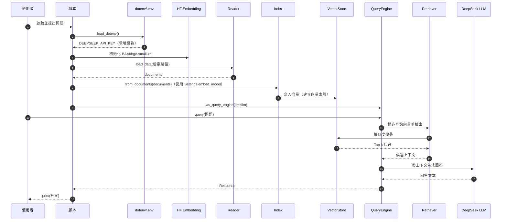
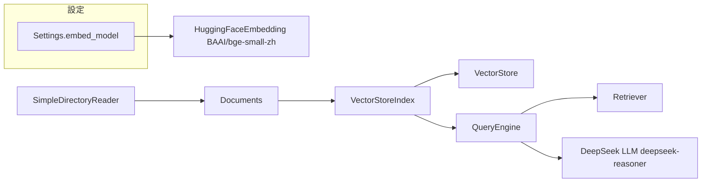

## 總覽

本文件對應代碼：`00-简单RAG-SimpleRAG/01_03_LlamaIndex_更换生成模型.py`。

本示例在保留最小 RAG 主流程（讀取 → 建索引 → 檢索 → 生成）的前提下，將「生成模型（LLM）」更換為 DeepSeek（`deepseek-reasoner`），同時透過 `Settings.embed_model` 指定 HuggingFace 的中文嵌入模型 `BAAI/bge-small-zh`。最終實現：本地/離線計算嵌入 + 在線 DeepSeek 生成回答。

> 依賴建議（遵守 uv 規範）：
> - `uv add llama-index-embeddings-huggingface llama-index-llms-deepseek python-dotenv`
> - 若下載 HF 權重受限：設置 `HF_ENDPOINT=https://hf-mirror.com`

---

## 流程圖（Overview Flow）

```mermaid
flowchart TD
  A[啟動腳本] --> B[load_dotenv 讀取 .env]
  B --> C[Settings.embed_model = HuggingFaceEmbedding("BAAI/bge-small-zh")]
  C --> D[初始化 DeepSeek LLM: model=deepseek-reasoner]
  D --> E[SimpleDirectoryReader 載入 90-文档-Data/黑悟空/设定.txt]
  E --> F[得到 Documents]
  F --> G[VectorStoreIndex.from_documents(documents)]
  G --> H[index.as_query_engine(llm=llm)]
  H --> I[query("黑神話悟空中有哪些戰鬥工具？")]
  I --> J[檢索：相似度搜尋 Top-k]
  J --> K[生成：DeepSeek 基於上下文生成答案]
  K --> L[print(...) 輸出結果]
```

---

## 時序圖（Sequence）



---

## 依賴關係圖（Modules & Dependencies）



---

## 分步講解（逐行/逐模組）

對應代碼：`00-简单RAG-SimpleRAG/01_03_LlamaIndex_更换生成模型.py`

```python
from llama_index.core import VectorStoreIndex, SimpleDirectoryReader
from llama_index.embeddings.huggingface import HuggingFaceEmbedding
from llama_index.llms.deepseek import DeepSeek

from llama_index.core import Settings

from dotenv import load_dotenv
import os

load_dotenv()

Settings.embed_model = HuggingFaceEmbedding("BAAI/bge-small-zh")

llm = DeepSeek(
    model="deepseek-reasoner",
    api_key=os.getenv("DEEPSEEK_API_KEY")
)

documents = SimpleDirectoryReader(input_files=["90-文档-Data/黑悟空/设定.txt"]).load_data()

index = VectorStoreIndex.from_documents(documents)

query_engine = index.as_query_engine(llm=llm)

print(query_engine.query("黑神话悟空中有哪些战斗工具?"))
```

- 依賴與設定
  - 使用 `python-dotenv` 的 `load_dotenv()` 載入 `.env`，從而獲取 `DEEPSEEK_API_KEY`。
  - 以 `Settings.embed_model = HuggingFaceEmbedding("BAAI/bge-small-zh")` 指定全域預設嵌入模型。
  - 初始化 `DeepSeek(model="deepseek-reasoner", api_key=...)` 作為生成模型。

- 數據載入（Reader）
  - `SimpleDirectoryReader(...).load_data()` 讀入本地文本並產生 `Document` 列表。

- 建立索引（Index + VectorStore）
  - `VectorStoreIndex.from_documents(documents)`：使用前述 `Settings.embed_model` 進行文本向量化，並存入向量庫。

- 查詢與生成（QueryEngine）
  - `index.as_query_engine(llm=llm)`：顯式覆蓋預設 LLM，使用 DeepSeek 完成帶上下文的答案生成。
  - `query_engine.query(...)`：將問題向量化檢索相關片段（Retriever），然後交由 DeepSeek 生成最終回答。

> 小貼士：若同時設定 `Settings.llm` 與 `as_query_engine(llm=...)`，以 `as_query_engine` 所傳入的 `llm` 優先。

---

## 關鍵點總結

- **生成模型替換**：以 `DeepSeek(deepseek-reasoner)` 取代預設 LLM，通過 `.env` 提供 `DEEPSEEK_API_KEY`。
- **嵌入模型**：`Settings.embed_model = HuggingFaceEmbedding("BAAI/bge-small-zh")`，中文效果佳、可本地計算。
- **主流程不變**：讀取 → 建索引（向量化） → 檢索（Top-k） → 生成（DeepSeek） → 輸出。
- **安裝與網路**：建議用 `uv add` 安裝依賴；如 HF 下載受限，可設 `HF_ENDPOINT` 鏡像。
- **可擴展**：可改用本地 LLM（如 Ollama）以完全離線；也可外接向量庫（Milvus/FAISS）與調整分塊、Top-k。


