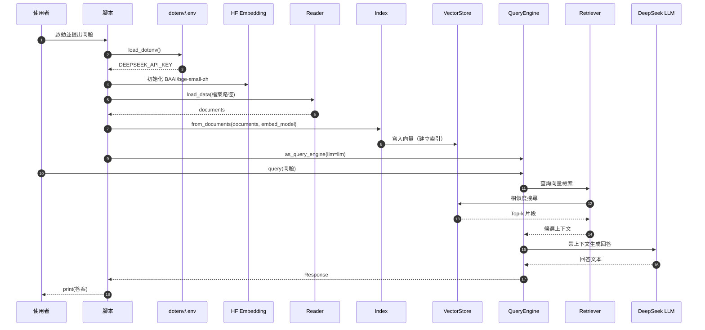
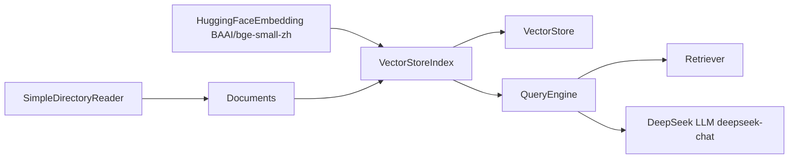

## 總覽

本文件對應代碼：`00-简单RAG-SimpleRAG/01_04_LlamaIndex_5行代码_DeepSeek.py`。

示例在「5 行最小流程」基礎上，同時：
- 使用 HuggingFace 的中文嵌入模型 `BAAI/bge-small-zh` 進行本地/離線向量化；
- 使用 DeepSeek Chat 作為生成模型（需 `DEEPSEEK_API_KEY`）。

整體路徑：讀取文本 → 建立向量索引（本地嵌入） → 查詢檢索 → DeepSeek 生成 → 輸出。

---

## 流程圖（Overview Flow）

```mermaid
flowchart TD
  A[啟動腳本] --> B[load_dotenv 載入環境變數]
  B --> C[初始化 HuggingFaceEmbedding: BAAI/bge-small-zh]
  C --> D[初始化 DeepSeek LLM: deepseek-chat]
  D --> E[SimpleDirectoryReader 載入 90-文档-Data/黑悟空/设定.txt]
  E --> F[得到 Documents]
  F --> G[VectorStoreIndex.from_documents(documents, embed_model)]
  G --> H[index.as_query_engine(llm=llm)]
  H --> I[query("黑神話悟空中有哪些戰鬥工具？")]
  I --> J[檢索：相似度搜尋 Top-k]
  J --> K[生成：DeepSeek 基於上下文生成答案]
  K --> L[print(...) 輸出結果]
```

---

## 時序圖（Sequence）



---

## 依賴關係圖（Modules & Dependencies）



---

## 分步講解（逐行/逐模組）

對應代碼：`00-简单RAG-SimpleRAG/01_04_LlamaIndex_5行代码_DeepSeek.py`

```python
from llama_index.core import VectorStoreIndex, SimpleDirectoryReader
from llama_index.embeddings.huggingface import HuggingFaceEmbedding
from llama_index.llms.deepseek import DeepSeek
from dotenv import load_dotenv
import os

load_dotenv()

embed_model = HuggingFaceEmbedding(model_name="BAAI/bge-small-zh")

llm = DeepSeek(
    model="deepseek-chat",
    api_key=os.getenv("DEEPSEEK_API_KEY")
)

documents = SimpleDirectoryReader(input_files=["90-文档-Data/黑悟空/设定.txt"]).load_data()

index = VectorStoreIndex.from_documents(
    documents,
    embed_model=embed_model
)

query_engine = index.as_query_engine(llm=llm)

print(query_engine.query("黑神话悟空中有哪些战斗工具?"))
```

- 環境與依賴
  - `load_dotenv()` 從 `.env` 載入 `DEEPSEEK_API_KEY`；若 HF 受限，可設 `HF_ENDPOINT=https://hf-mirror.com`。
  - 嵌入：`HuggingFaceEmbedding("BAAI/bge-small-zh")`，中文表現佳、可離線。
  - 生成：`DeepSeek(model="deepseek-chat", api_key=...)`。

- 數據載入（Reader）
  - `SimpleDirectoryReader(...).load_data()` 讀取本地檔案，產生 `Document` 列表。

- 建立索引（Index + 向量庫）
  - `VectorStoreIndex.from_documents(documents, embed_model)` 用 HF 模型向量化文本並寫入向量庫。

- 查詢與生成（QueryEngine）
  - `index.as_query_engine(llm=llm)` 顯式指定 DeepSeek 為生成模型。
  - `query_engine.query(...)`：檢索 Top-k 片段 → 帶上下文提示 DeepSeek → 回傳回答。

---

## 關鍵點總結

- **本地嵌入**：`HuggingFaceEmbedding(BAAI/bge-small-zh)`，降低成本與依賴。
- **生成模型**：`DeepSeek(deepseek-chat)`，需設定 `DEEPSEEK_API_KEY`。
- **索引構建**：`VectorStoreIndex.from_documents(..., embed_model=...)` 明確指定嵌入模型。
- **查詢引擎**：`as_query_engine(llm=...)` 覆蓋預設 LLM，按需切換。
- **可擴展**：可替換為本地 LLM（Ollama 等）以完全離線；可外接向量庫（Milvus/FAISS）與調整分塊、Top-k。


