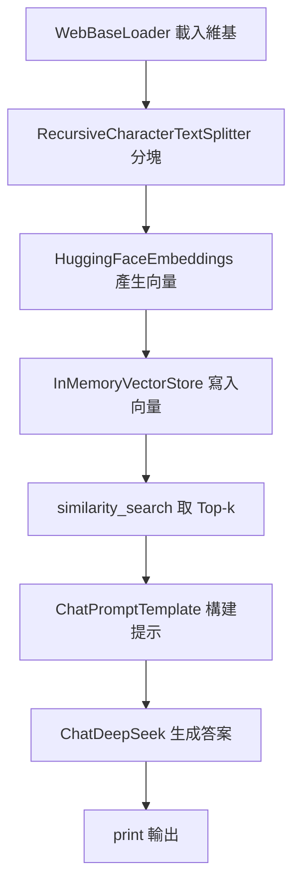

## 總覽

本文件對應：`00-简单RAG-SimpleRAG/02_01_LangChain_DeepSeek_Model_v1.py`。

示例使用 LangChain：抓取維基頁面 → 分塊 → HF 嵌入 → 內存向量庫檢索 → `ChatDeepSeek` 基於上下文生成答案。

---

## 流程圖

---

## 分步講解

- 文檔來源：`WebBaseLoader(https://zh.wikipedia.org/...)` 直接抓取頁面文本。
- 分塊策略：`RecursiveCharacterTextSplitter(chunk_size=1000, overlap=200)`。
- 嵌入模型：`HuggingFaceEmbeddings("BAAI/bge-small-zh-v1.5")`，開啟 `normalize_embeddings`。
- 向量庫：`InMemoryVectorStore`，適合小型示例。
- 生成模型：`ChatDeepSeek(model="deepseek-chat", api_key=ENV)`。

---

## 關鍵點總結

- **端到端最小 RAG**：抓取 → 分塊 → 嵌入 → 檢索 → 生成。
- **中文友好**：BGE 中文嵌入 + DeepSeek 中文能力。
- **易於替換**：可替換向量庫或模型以擴展規模與性能。

