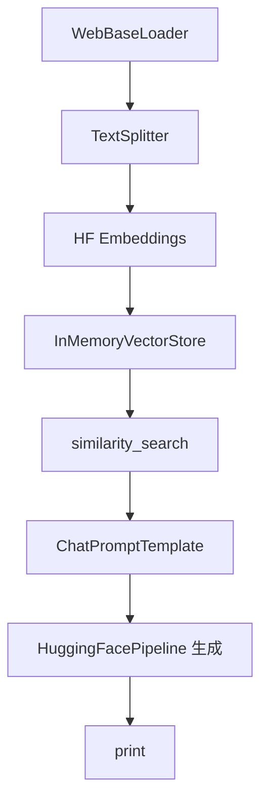

## 總覽

本文件對應：`00-简单RAG-SimpleRAG/02_04_LangChain_HuggingFace_Model.py`。

示例在 LangChain 中同時使用 HuggingFace：
- 嵌入：`HuggingFaceEmbeddings(BAAI/bge-small-zh-v1.5)` 本地向量化；
- 生成：`HuggingFacePipeline`（`transformers` pipeline）本地推理。

---

## 流程圖

---

## 分步講解

- HF 嵌入：中文 BGE 模型，開啟 `normalize_embeddings`。
- HF 生成：`Qwen/Qwen2.5-1.5B` 作為示例，可替換為本地可用模型；注意顯存/記憶體要求。
- 內存向量庫：示例級用法，便於入門與教學。

---

## 關鍵點總結

- **完全本地**：不依賴雲端 API。
- **可擴展**：可替換為更大模型或外部向量庫（如 FAISS/Milvus）。

