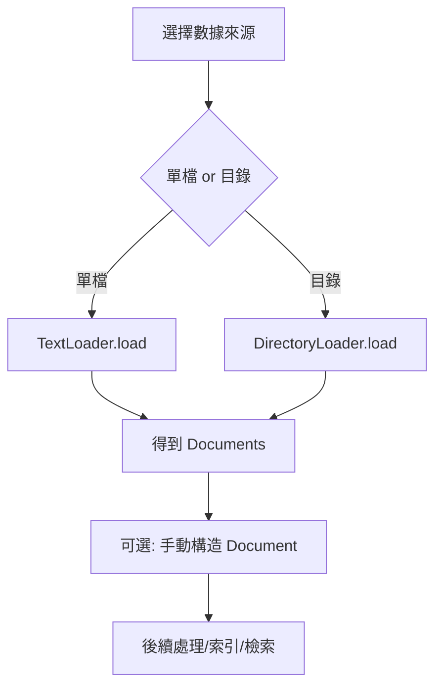

## 總覽

本筆記示例展示 LangChain 文檔導入與 `Document` 結構的基礎操作：
1) 用 `TextLoader` 讀單檔；2) 手動構造 `Document`；3) 用 `DirectoryLoader` 載整個目錄（含參數、換工具、忽略錯誤）。

---

## 流程圖

---

## 分步講解

- 單檔導入（`TextLoader`）
  - 指定檔案路徑，`loader.load()` 產生 `List[Document]`，每個含 `page_content` 與 `metadata`。

- 手動構造 `Document`
  - `Document(page_content=..., metadata={...})`，適合自定義來源或拼裝內容。

- 目錄導入（`DirectoryLoader`）
  - 可指定 `glob`、`use_multithreading`、`show_progress` 等參數；
  - 可切換 `loader_cls`（如 `TextLoader`）覆蓋預設；
  - 設 `silent_errors=True` 可跳過無法解析的檔案（如圖片、PDF）。

---

## 關鍵點總結

- **Document** 是 LangChain 的標準文本單元，含內容與元資料。
- **DirectoryLoader** 能遞迴載入多格式檔案，必要時結合 `unstructured` 解析。
- **錯誤韌性**：`silent_errors=True` 在混合格式目錄中特別實用。

