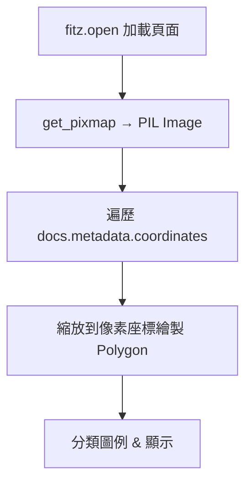

## 總覽

對應：`08-渲染PDF页面版式.py` 與 `08-分析PDF布局.ipynb`（邏輯相關）。示例以 PyMuPDF 渲染頁面，根據 `unstructured` 返回的座標繪制分類框（Title/Image/Table/Text）。

---

## 流程圖

---

## 關鍵點總結

- **版面可視化**：直觀理解解析出的區塊與對齊位置。
- **教學性**：有助於調參與驗證元素分類質量。

