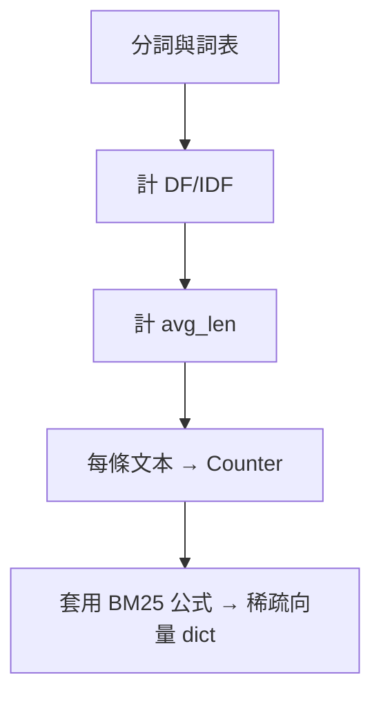

## 總覽

對應：`03-BM25.py`。手寫 BM25 稀疏向量生成：構建詞表/DF/IDF，按 BM25 公式計算每條文本的稀疏嵌入。

---

## 公式

BM25 分數：\( score = idf(word) * \frac{tf (k1 + 1)}{tf + k1 (1 - b + b * \frac{|d|}{avg|d|})} \)

---

## 流程圖

---

## 關鍵點總結

- **稀疏表示**：利於可解釋與混合檢索（BM25 + 向量）。

