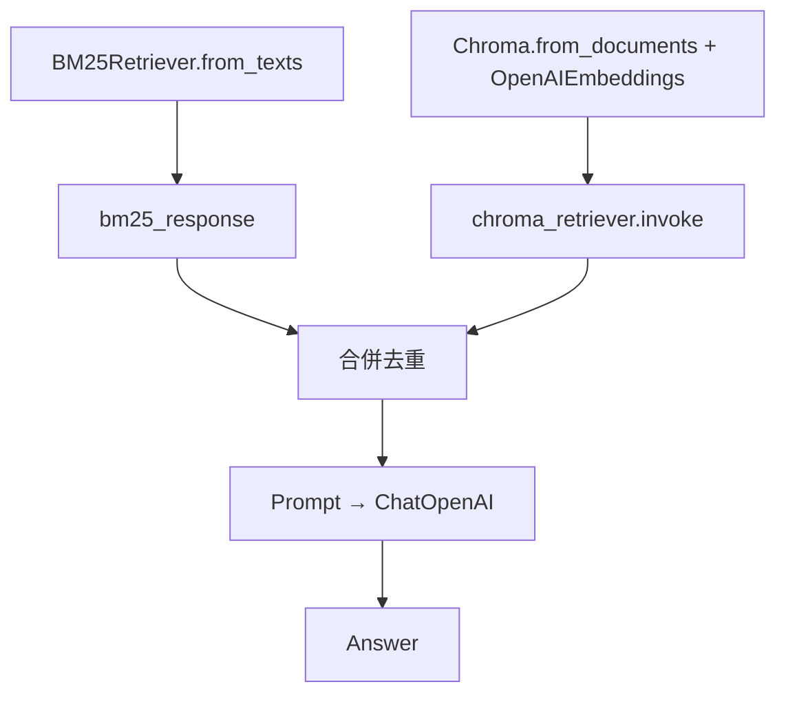

## 總覽

對應：`03-LangChain-BM25.py`。對比 BM25 檢索與向量檢索（Chroma+OpenAIEmbeddings），並做簡單混合檢索後交由 LLM 生成答案。

---

## 流程圖

```mermaid
flowchart TD
  A[BM25Retriever.from_texts] --> B[bm25_response]
  C[Chroma.from_documents + OpenAIEmbeddings] --> D[chroma_retriever.invoke]
  B --> E[合併去重]
  D --> E
  E --> F[Prompt → ChatOpenAI]
  F --> G[Answer]
```

---

## 關鍵點總結

- **混合檢索**：兼顧詞項匹配與語義匹配。
- **工程要點**：注意 API Key 與 base_url 的環境變數配置。

