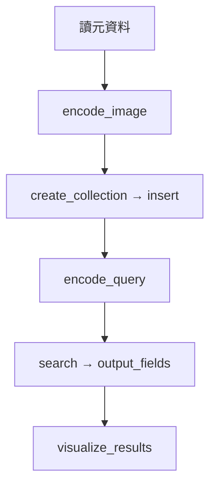

## 總覽

對應：`多模态检索/Milvus+Visual-BGE多模态检索-英文.py`。與中文版本一致，但使用英文字嵌入模型設定與路徑；流程相同。

---

## 流程圖

```mermaid
flowchart TD
  A[讀元資料] --> B[encode_image]
  B --> C[create_collection → insert]
  C --> D[encode_query]
  D --> E[search → output_fields]
  E --> F[visualize_results]
```

---

## 關鍵點總結

- **模型切換**：可換 `model_name` 與 `model_weight` 以適配英文場景。

