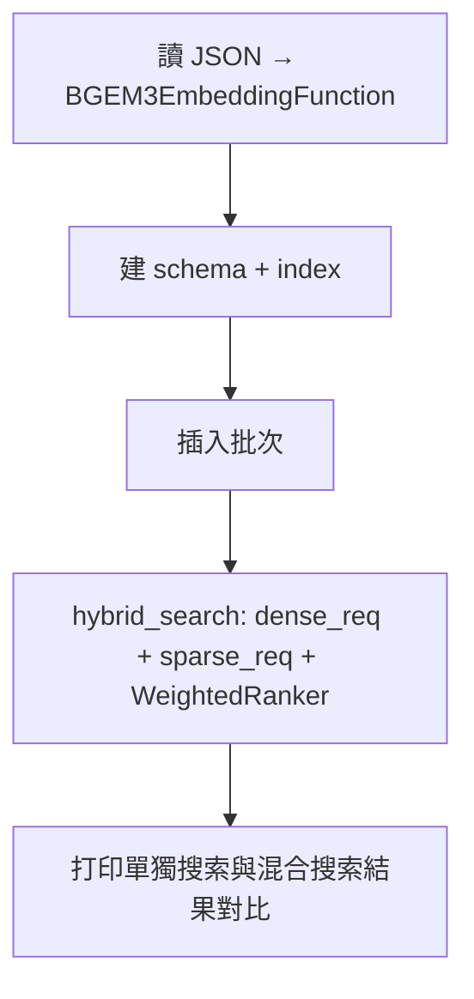

## 總覽

對應：`混合检索/Milvus+BGE-M3混合检索-v2-细节.py`。與 v1 類似，但打印更多中間資訊（向量形狀、稀疏非零數等），便於除錯與理解。

---

## 流程圖

```mermaid
flowchart TD
  A[讀 JSON → BGEM3EmbeddingFunction] --> B[建 schema + index]
  B --> C[插入批次]
  C --> D[hybrid_search: dense_req + sparse_req + WeightedRanker]
  D --> E[打印單獨搜索與混合搜索結果對比]
```

---

## 關鍵點總結

- **可觀察性**：稀疏行 coo/csr 兼容處理；詳列元素索引/數據示例。

