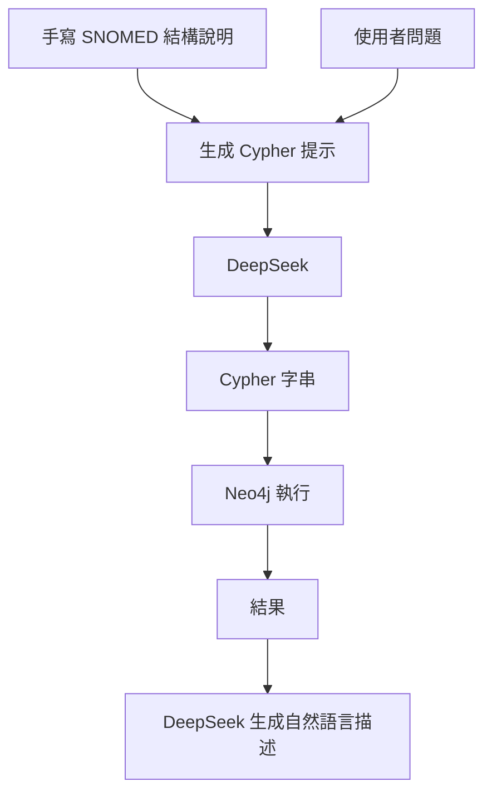

### 總覽
以「手寫固定 Schema 描述」引導 LLM 生成 SNOMED CT 的 Cypher 查詢，並在 Neo4j 中執行，再將結果轉成自然語言解釋。由於 Schema 不是動態獲取，易因實際庫結構偏差導致失敗。

### 流程圖

### 分步講解
- 直接在程式內嵌 SNOMED 節點/關係/屬性說明，請 LLM 產出 Cypher。
- 執行後若成功則請 LLM 轉成通俗解釋；若結構不符則可能報錯或空結果。

### 關鍵點總結
- **失敗原因常見**：實際圖庫標籤/關係名與手寫描述不完全一致。
- **建議**：改用 v2 動態探查庫結構以避免偏差。

