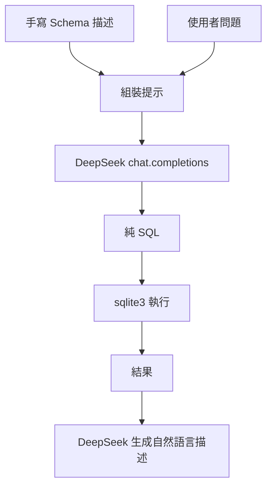

### 總覽
與 OpenAI 版本邏輯相同，但改用 DeepSeek API（`base_url=https://api.deepseek.com`），在同一個 SQLite 測試庫上完成 SQL 生成→執行→結果解釋的閉環。

### 流程圖

### 分步講解
- 使用 `OpenAI(base_url=..., api_key=DEEPSEEK_API_KEY)` 初始化客戶端。
- 生成 SQL、去除可能代碼塊標記後執行；將結果轉成便於 LLM 理解的結構再喚起生成自然語言描述。

### 關鍵點總結
- **一致性**：Prompt 與執行路徑與 OpenAI 版一致，便於 A/B 對比。
- **壞味道提醒**：與 OpenAI 版相同，請在關閉連線前取用 `cursor.description` 以獲取列名。

