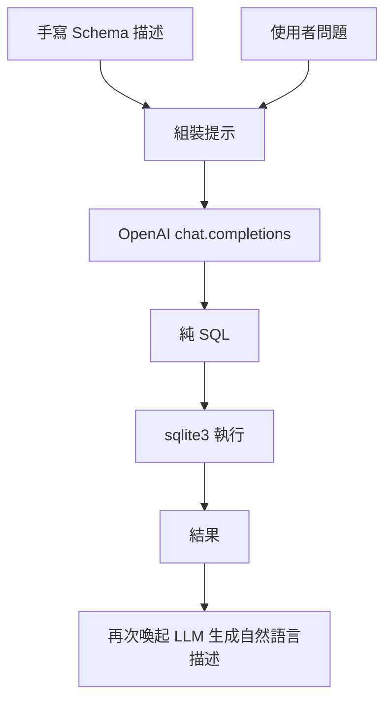

### 總覽
利用 OpenAI 模型根據「Schema 描述 + 使用者問題」直接生成 SQL，執行後再將查詢結果轉為自然語言描述。此為最小可行 Text2SQL 範例。

### 流程圖


### 分步講解
- 準備 Schema 說明文字，明確兩表關聯欄位（`city` ↔ `city_name`）。
- 調用 LLM 生成 SQL，去除可能的 Markdown 代碼塊標記。
- 執行 SQL 並打印結果；將結果（含列名）餵給 LLM 產生易懂的中文解釋。

### 關鍵點總結
- **輸出清洗**：需去除 ```sql/``` 標記以避免執行錯誤。
- **壞味道提醒**：結果生成階段使用了 `cursor.description`，請確保在關閉連線前讀取列名；避免關閉後再訪問游標屬性造成潛在錯誤。


