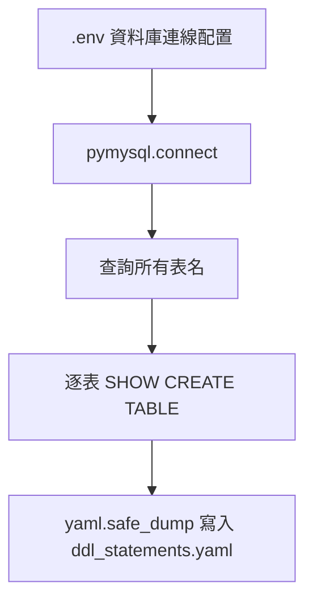

### 總覽
連線 MySQL 的 `sakila` 資料庫，讀取所有表名並依序執行 `SHOW CREATE TABLE`，將完整 DDL 蒐集為字典，最後寫出到 `90-文档-Data/sakila/ddl_statements.yaml`，作為後續 RAG 的結構知識來源。

### 流程圖

### 分步講解
- 載入環境變數，建立 MySQL 連線。
- 查詢 `information_schema.tables` 取得 `sakila` 下所有表名。
- 迴圈執行 `SHOW CREATE TABLE db.table`，收集 DDL。
- 將 `{table: ddl}` 字典以 YAML 輸出，供後續檢索使用。

### 關鍵點總結
- **DDL 作為結構知識**：能夠幫助 LLM 生成更可靠的 SQL。
- **權限**：需確保資料庫用戶具備 `SHOW CREATE TABLE` 權限。
- **檔案位置**：輸出到 `90-文档-Data/sakila/ddl_statements.yaml`，與其他知識文件保持一致路徑。

