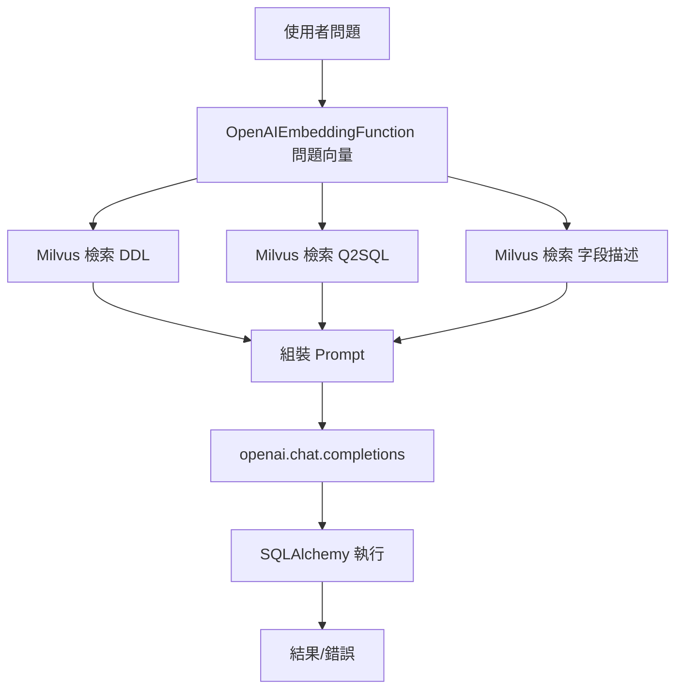

### 總覽
基於三源知識（DDL / 字段描述 / 問答樣本）組裝 Prompt，直接請 LLM 產生 SQL 並執行。本版本屬早期雛形，對輸出格式與錯誤恢復較弱，容易出現代碼塊包裹、語法不嚴格等問題。

### 流程圖


### 分步講解
- 嵌入與檢索：以問題向量在三個集合檢索，合併成上下文。
- Prompt 組裝：拼接 Schema、字段描述、案例與當前 Query。
- 生成與執行：直接請模型返回 SQL，嘗試執行並打印結果。

### 關鍵點總結
- **易錯點**：
  - LLM 可能輸出帶 ```sql 代碼塊；
  - 輸出非單一 SQL；
  - 語法/表名不一致導致執行失敗。
- **改進方向**：見 v2、v3（錨點提示與錯誤驅動重試）。


