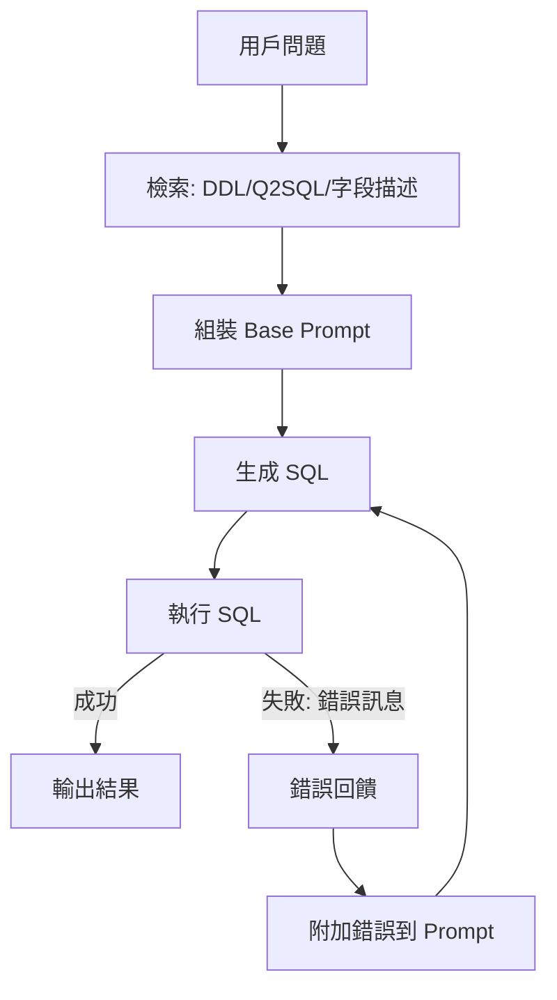

### 總覽
引入「錯誤反饋→修正重試」機制：若 SQL 執行報錯，將錯誤訊息回饋給 LLM 要求修復，最多重試 `max_retries` 次，顯著提升端到端成功率。

### 流程圖

### 分步講解
- `generate_sql(prompt, error_msg)`：將上一輪的錯誤訊息拼接到 Prompt 中，要求 LLM 修正。
- `execute_sql`：統一捕獲異常，返回 `(success, cols, rows_or_error)`。
- 迴圈重試：最多 `max_retries` 次；成功則打印結果並結束。

### 關鍵點總結
- **實用性**：面對表名、別名、函數不兼容等錯誤時效果明顯。
- **保護欄**：限制最大重試次數，避免無限循環。
- **可擴展**：可把錯誤分類（語法/語義/權限）並提供更針對性的修復提示。

