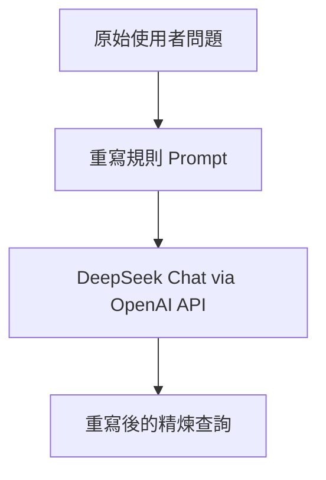

### 總覽
以一段明確規則的提示詞，調用 DeepSeek 模型對原始使用者問題進行「清洗與重寫」，刪除雜訊、保留核心意圖，便於後續檢索與生成。

### 流程圖

### 分步講解
- 客戶端初始化
  - 使用 `OpenAI(base_url="https://api.deepseek.com")` 與 `DEEPSEEK_API_KEY` 進行認證。

- 提示詞設計
  - 規則包含：移除無關資訊、使用精確術語、保持核心意圖、將模糊轉具體等。

- 調用與輸出
  - `client.chat.completions.create(model="deepseek-chat", messages=[...], temperature=0)`。
  - 回傳 `choices[0].message.content.strip()` 作為重寫結果。

### 關鍵點總結
- **確定性**：`temperature=0` 保證重寫一致性。
- **規則先於模型**：明確的提示規則往往比單純調模型更有效。
- **適用場景**：原始問題冗長、口語化或包含噪音時。

