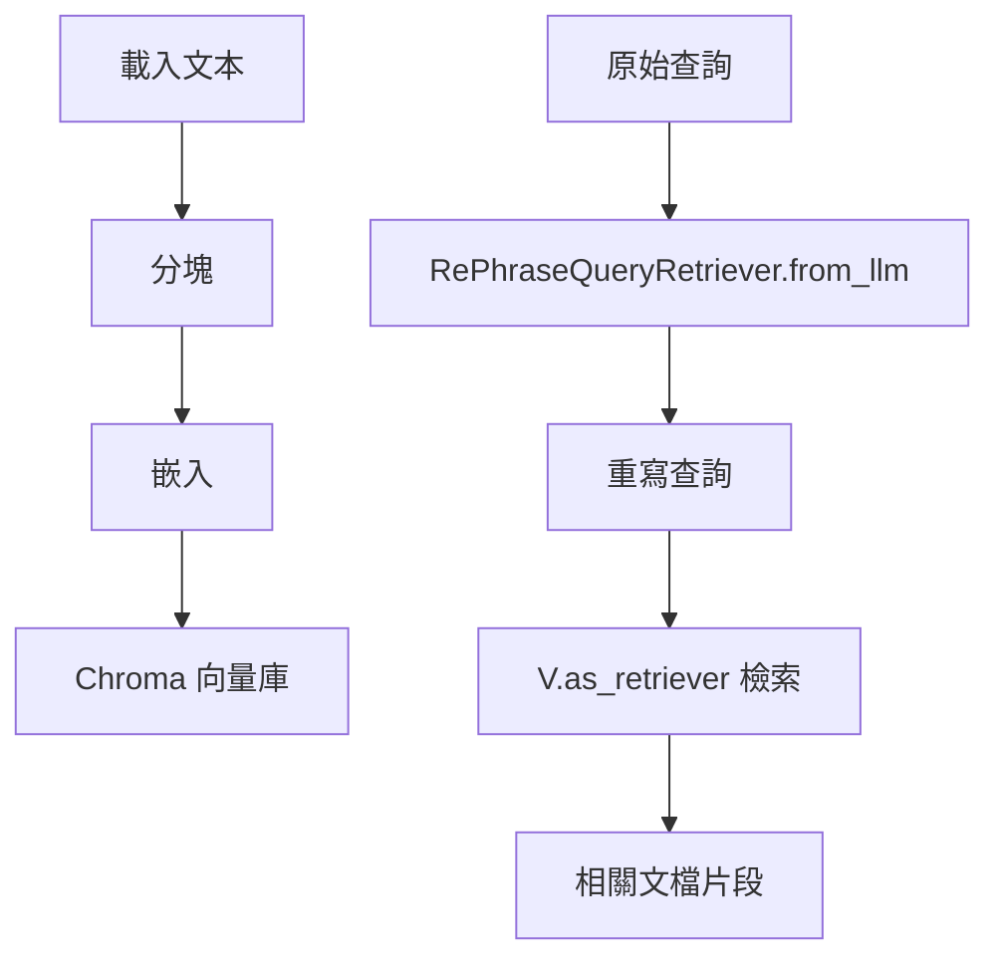

### 總覽
使用 LangChain 的 `RePhraseQueryRetriever`，在檢索前由 LLM 對查詢自動「重述」，以更貼近語料表述方式，提升召回率與精確度。

### 流程圖

### 分步講解
- 數據準備
  - `TextLoader` → `RecursiveCharacterTextSplitter` → `HuggingFaceEmbeddings` → `Chroma`。

- 設置重述檢索器
  - `ChatDeepSeek(temperature=0)` 作為重寫模型。
  - `RePhraseQueryRetriever.from_llm(retriever=..., llm=...)` 自動將 Q 轉換為更檢索友好的表述。

- 調用
  - `docs = retriever_from_llm.invoke(query)` 返回重寫後檢索的文檔。

### 關鍵點總結
- **兼容性強**：對原始口語化、冗長或含錯別字的查詢效果好。
- **可組合**：可與重排、壓縮等後處理串接。
- **觀測**：建議打開 `langchain.retrievers.re_phraser` 的日誌便於調參。

