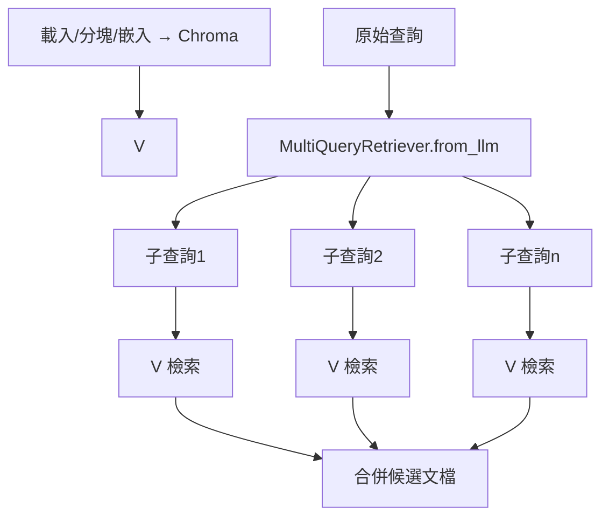

### 總覽
利用 `MultiQueryRetriever.from_llm`，由 LLM 自動生成多個互補視角的查詢，並對每個子查詢單獨檢索，綜合提升召回覆蓋。

### 流程圖

### 分步講解
- 基礎向量庫
  - `TextLoader` → `RecursiveCharacterTextSplitter` → `HuggingFaceEmbeddings` → `Chroma`。

- 多查詢生成
  - `ChatDeepSeek(temperature=0)` 作為子查詢生成模型。
  - `MultiQueryRetriever.from_llm(retriever=..., llm=...)` 自動生成若干互補查詢。

- 調用
  - `docs = retriever_from_llm.invoke(query)` 返回合併後的文檔結果。

### 關鍵點總結
- **覆蓋增益**：對多面向問題（如流程、策略、裝備）更全面。
- **成本權衡**：子查詢越多 → 檢索/重排成本越高。
- **與重排搭配**：建議後續接 RRF 或交叉編碼器重排。

