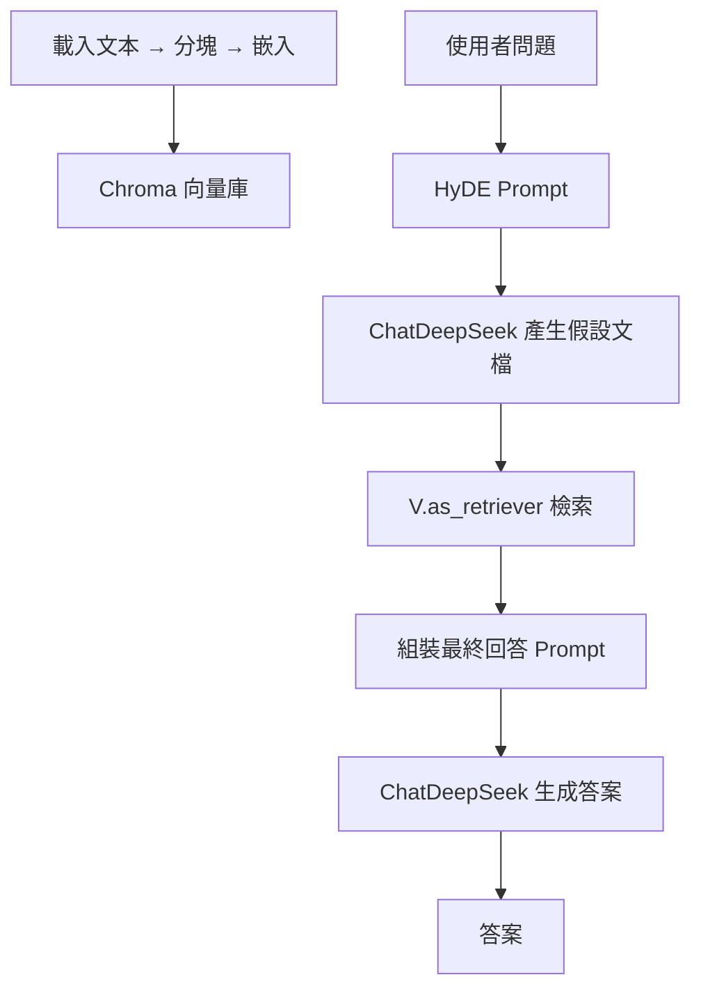

### 總覽
採用 HyDE（Hypothetical Document Embeddings）思想：先由 LLM 生成與問題相關的「假設文檔」，再用該文檔去檢索向量庫，最後結合檢索內容生成答案，常能提升召回效果。

### 流程圖

### 分步講解
- 構建向量庫
  - `TextLoader` → `RecursiveCharacterTextSplitter`（chunk 500, overlap 0）→ `HuggingFaceEmbeddings`（`BAAI/bge-small-zh`）→ `Chroma`。

- 假設文檔生成鏈 `generate_docs_for_retrieval`
  - `ChatPromptTemplate.from_template` 定義 HyDE 提示。
  - `prompt | llm | StrOutputParser()` 取得可用純文字文檔。

- 檢索與最終生成
  - 以 HyDE 文檔作查詢進行檢索：`generate_docs_for_retrieval | retriever`。
  - 將檢索結果與原問題注入 `answer_prompt`，再由 LLM 生成最終答案。

### 關鍵點總結
- **召回提升**：在低資源或描述稀疏場景尤其有效。
- **可管控性**：HyDE 模板可針對領域調整風格與內容密度。
- **成本注意**：增加一次 LLM 調用與一次檢索。

