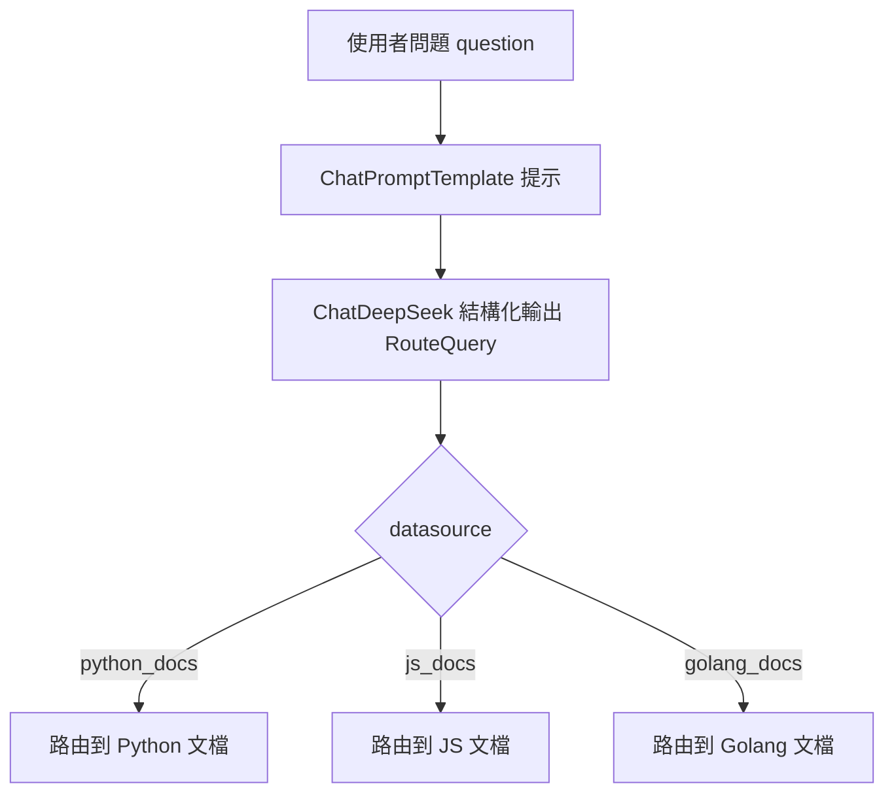

### 總覽
本範例演示如何用大模型進行「邏輯路由」：將使用者的問題依據語義與領域自動分流到最合適的資料源（例如 `python_docs` / `js_docs` / `golang_docs`）。核心做法是使用結構化輸出（Pydantic 模型）約束 LLM 的返回格式，讓路由結果可直接作為下游檢索或回答的依據。

### 流程圖

### 分步講解
- 建模路由輸出
  - 使用 `RouteQuery`（Pydantic BaseModel）將 `datasource` 約束為 `Literal["python_docs", "js_docs", "golang_docs"]`，確保模型輸出合法值。

- 建立路由器（create_router）
  - `ChatDeepSeek(model="deepseek-chat", temperature=0)`：確定性輸出，減少隨機性。
  - `with_structured_output(RouteQuery)`：強制 LLM 返回可直接解析為 `RouteQuery` 的結構。
  - `ChatPromptTemplate.from_messages([...])`：提供系統與人類訊息，說明任務與輸入。
  - 透過 `prompt | structured_llm` 串接為可直接 `invoke` 的鏈。

- 問題路由（route_question）
  - 建立路由器後，`router.invoke({"question": question})` 取得結構化結果。
  - 返回 `result.datasource` 作為路由決策。

- 範例
  - 輸入「Python中的列表和元組有什麼區別？」→ 期望路由到 `python_docs`。

### 關鍵點總結
- **RouteQuery**：以強型別約束輸出，避免隨機字串導致路由失敗。
- **with_structured_output**：讓 LLM 返回可直接用於業務決策的物件。
- **ChatPromptTemplate**：清楚描述任務邏輯，提升穩定度。
- **擴展方式**：新增資料源時，更新 `Literal` 枚舉與提示中的說明即可。

> 提示：若要與檢索系統整合，可在獲得 `datasource` 後選擇對應的向量庫或知識庫進行檢索，再進入生成階段。

