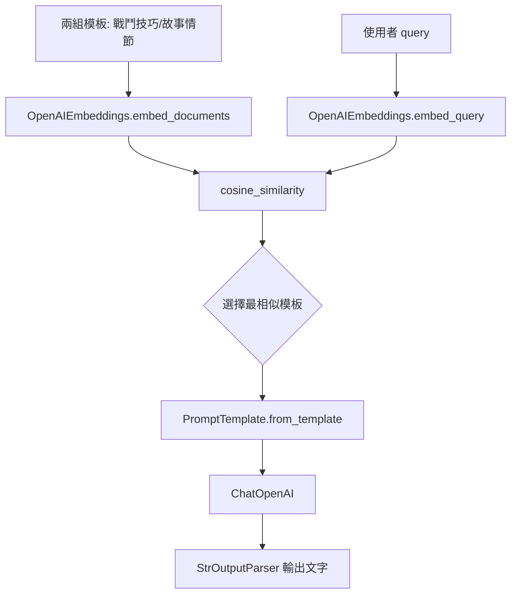

### 總覽
本範例展示「語義路由」：先離線嵌入多個提示模板，對使用者查詢進行向量化後以餘弦相似度選出最相近的模板，動態組裝 Prompt 再交由 LLM 生成答案。此法可在不同意圖間切換專用提示，兼顧準確與可控。

### 流程圖

### 分步講解
- 準備模板與嵌入
  - 兩個模板：`combat_template` / `story_template`，並用 `OpenAIEmbeddings` 對模板文字嵌入。

- 路由器函數 `prompt_router`
  - 對輸入 `input["query"]` 嵌入，與模板向量做 `cosine_similarity`，取 `argmax` 對應模板。
  - 回傳對應的 `PromptTemplate` 實例（並打印選擇結果）。

- 可組合式鏈
  - `{"query": RunnablePassthrough()} | RunnableLambda(prompt_router) | ChatOpenAI() | StrOutputParser()`
  - 以資料流方式將 query → 選模板 → 生成 → 解析輸出。

- 範例
  - 問「黑悟空是如何打敗敵人的？」通常會命中「戰鬥技巧模板」。

### 關鍵點總結
- **語義選擇而非關鍵詞匹配**：降低模板選擇的脆弱性。
- **Runnable 組裝**：使路由邏輯與生成邏輯解耦，便於擴展更多模板。
- **可觀測性**：打印選用模板，便於調參與除錯。
- **風險**：嵌入模型與語言域偏差會影響路由效果，需用場景語料校準。

