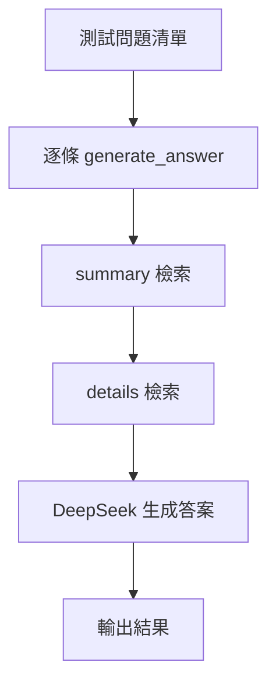

### 總覽
針對雙層 Milvus 方案，提供一組多樣化測試查詢（基本、比較、趨勢、複雜），驗證從 summary → details 的分層檢索鏈路與最終回答的穩定性。

### 流程圖

### 分步講解
- 問題類型覆蓋：基本事實、跨年比較、比例趨勢、分群分析等。
- 執行：逐條調用 `generate_answer(query)`，打印輸出。

### 關鍵點總結
- **迭代依據**：錯解或不足可反推資料處理與索引設計。
- **觀測**：建議增加檢索中間結果的打印與質量評估指標。

