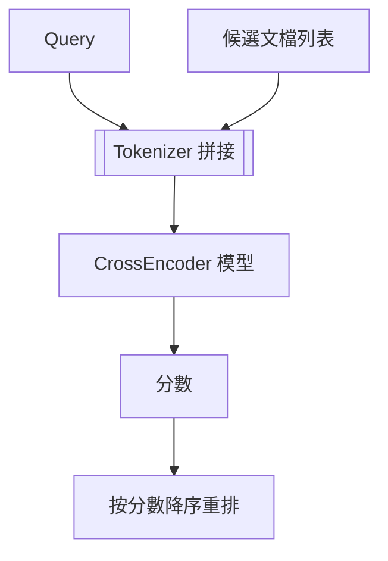

### 總覽
CrossEncoder 將「查詢 + 文檔」拼接後送入同一 Transformer，直接輸出相關性分數，用於重排候選文檔，精度高但計算開銷較大，適合二階段精排。

### 流程圖

### 分步講解
- 模型：`cross-encoder/ms-marco-MiniLM-L-12-v2`；`AutoTokenizer` + `AutoModelForSequenceClassification`。
- 輸入：`[CLS] query [SEP] document [SEP]`，最大長度 512，padding/truncation。
- 輸出：`outputs.logits[0][0]` 作為相關性分數，排序後輸出結果。

### 關鍵點總結
- **高精度**：捕捉查詢與文檔細粒度交互。
- **高成本**：每對 Q-D 都需一次前向；適合重排非初檢索。
- **最佳實踐**：Top-50/100 候選進行 CrossEncoder 精排，與 BM25/向量檢索互補。

