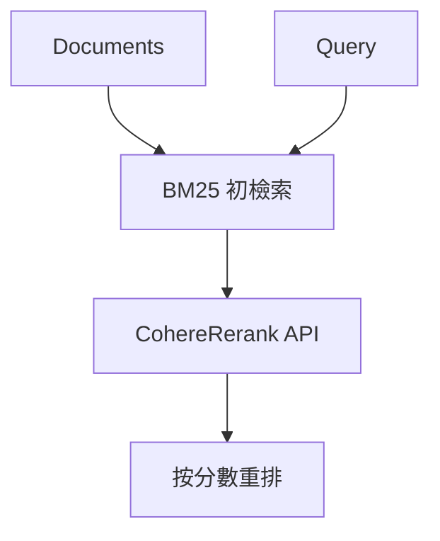

### 總覽
利用 Cohere 的雲端重排 API（`rerank-multilingual-v3.0`）對第一階段候選（BM25）做語義精排，優勢是開箱即用、多語種表現佳，適合商用場景快速集成。

### 流程圖

### 分步講解
- 初檢索：`BM25Retriever.from_documents` 得到 Top-K 候選。
- 重排器：`CohereRerank(model="rerank-multilingual-v3.0")` 調用雲端模型精排。
- 輸出：按相關性降序輸出候選，支持顯示 `score` 與 `metadata`。

### 關鍵點總結
- **多語優勢**：對中文等多語文本表現穩健。
- **工程友好**：API 形式易集成；注意金鑰安全與成本。
- **建議**：配合本地初檢索（BM25/向量）形成兩段式檢索。

