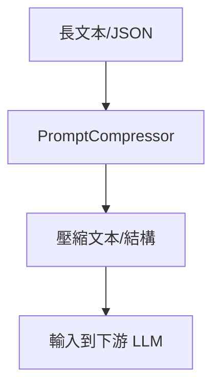

### 總覽
LLMLingua 透過小語言模型對長文本或 JSON 進行壓縮，在盡量保持核心信息的同時顯著降低 token 數，常用於 RAG 的檢索後壓縮或對話上下文壓縮。

### 流程圖

### 分步講解
- 初始化：`PromptCompressor(model_name="NousResearch/Llama-2-7b-hf", device_map="cpu")`。
- 文本壓縮：`compress_prompt(context, instruction, question, target_token)`。
- JSON 壓縮：`compress_json(json_data, json_config)`；支持字段級壓縮率、可移除鍵值對等策略。
- 失敗備援：若 JSON 壓縮失敗，回落到只壓縮其中的大文本字段。

### 關鍵點總結
- **Token 友好**：顯著降低 LLM 輸入長度與成本。
- **可配置**：針對不同字段設置壓縮率與是否壓縮。
- **兼容性**：確保機型權限與可用資源；CPU 模式避免顯存不足。

