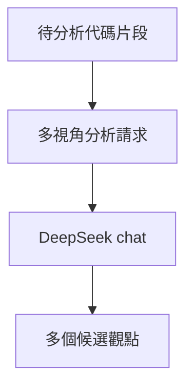

### 總覽
用 DeepSeek 生成多視角的候選分析，鼓勵覆蓋不同面向（輸入異常、權限、調用鏈等），提升回覆的全面性與多樣性。

### 流程圖

### 分步講解
- 客戶端：`OpenAI(base_url=https://api.deepseek.com)`；以 `DEEPSEEK_API_KEY` 認證。
- 提示：明確要求多視角覆蓋，限制溫度為 0.5 兼顧穩定與多樣。
- 輸出：列印所有 `choices` 候選，便於後續選擇/重排。

### 關鍵點總結
- **多樣性控制**：溫度與提示指令均會影響觀點多樣性。
- **後處理**：可在此基礎上加上重排或聚合模板，得到更結構化輸出。

