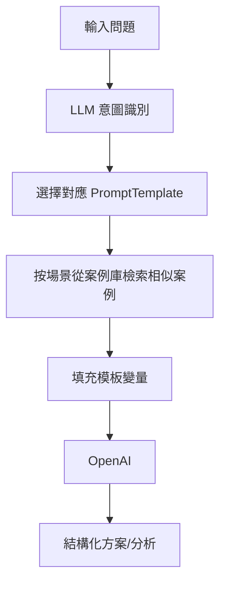

### 總覽
根據輸入問題的場景意圖自動路由到對應的提示模板，並從案例庫檢索相似案例拼接進提示，提高生成針對性與可操作性。

### 流程圖

### 分步講解
- 模板庫：`customer_service/technical_support/business_analysis` 三類模板。
- 意圖識別：用 LLM 直接返回場景標識（如 `customer_service`）。
- 案例檢索：對應場景下用 `OpenAIEmbeddings + FAISS` 檢索最相似案例，填入模板變量。
- 生成：以填充後模板喚起 LLM，產出分步方案。

### 關鍵點總結
- **路由 + 檢索**：先選模板再檢索，提升匹配度與上下文質量。
- **健壯性**：意圖輸出需做校驗；可加兜底模板防止不識別場景。

