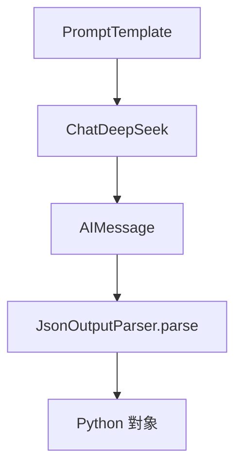

### 總覽
使用 `JsonOutputParser` 約束大模型輸出 JSON，並將 `AIMessage.content` 解析為 Python 結構，確保下游可編程消費。

### 流程圖

### 分步講解
- 定義解析器：`JsonOutputParser()`。
- 模板：簡單請求返回 JSON 格式的用戶資訊。
- 調用：`llm(prompt.format(...))` 獲取 `AIMessage`，取 `content`。
- 解析：`parser.parse(output.content)` 得到結構化對象。

### 關鍵點總結
- **強約束**：相較純文本，JSON 可被穩定解析與驗證。
- **容錯**：必要時可增加 JSON 修復策略（如 `parse(json_fix(...))`）。

