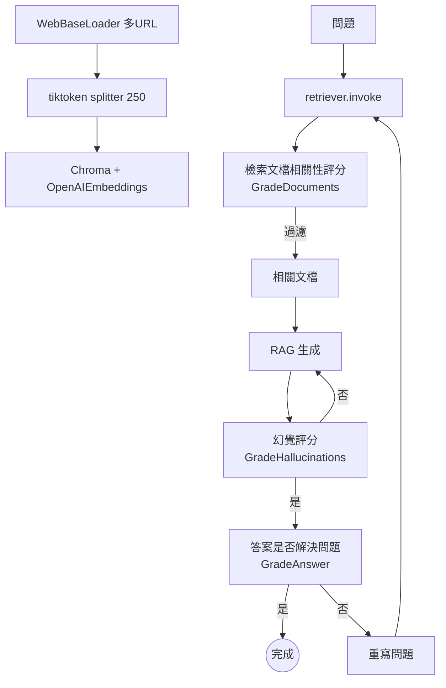

### 總覽
Self-RAG 流程在標準 RAG 的基礎上增加了「檢索質量評估、幻覺檢查、答案有效性評估」等環節，形成一個可自我糾偏與反覆試探的生成閉環。

### 流程圖

### 分步講解
- 向量庫：網頁內容 → tiktoken 切分（250）→ Chroma(OpenAIEmbeddings)。
- 檢索評分：`ChatOpenAI.with_structured_output(GradeDocuments)` 過濾不相關文檔。
- 生成：`hub.pull("rlm/rag-prompt") | ChatOpenAI | StrOutputParser`。
- 幻覺評估：`GradeHallucinations` 判斷生成是否基於文檔；若否，回到生成重試。
- 答案評估：`GradeAnswer` 若不滿足需求，進入問題重寫 → 再檢索 → 再生成。
- 編排：以 `langgraph` 將節點與條件邊構成工作流，直觀可觀測。

### 關鍵點總結
- **可觀測/可糾偏**：在生成前後插入評分器，顯著降低幻覺與無效回答。
- **成本權衡**：多輪評估與重試會增加延時與花費，需結合 SLA 設置迭代次數。

