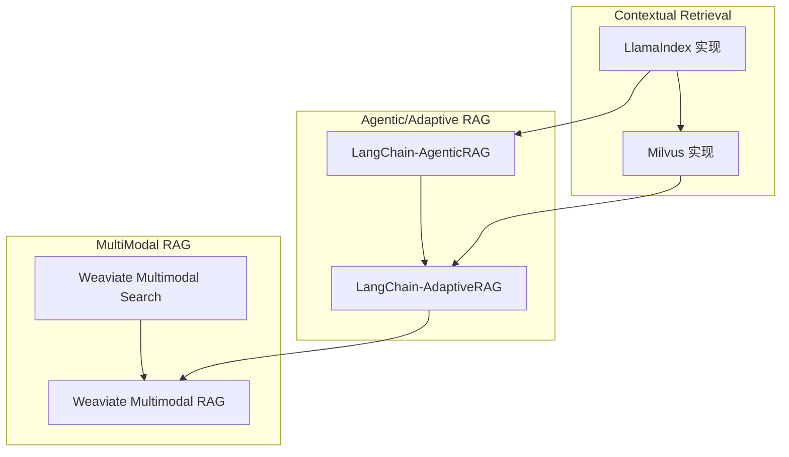

### 總覽
本模組匯總進階 RAG 策略：Contextual Retrieval（上下文檢索）、Agentic/Adaptive RAG（代理化與自適應決策）、MultiModal RAG（多模態檢索與生成）。目標是提升召回品質、降低幻覺、擴展多模態能力。

### 模塊關係圖


### 策略對比與最佳實踐

| 類別 | 方案 | 優勢 | 成本/延遲 | 適用場景 |
|---|---|---|---|---|
| Contextual | LlamaIndex Contextual | 接入簡易、評估工具完善 | 低-中 | 文本為主、快速試驗 |
| Contextual | Milvus Contextual | 易擴充、可做深度評估、可混合稀疏/重排 | 中 | 工程落地、需要 Pass@K 度量 |
| Agentic | Agentic RAG | 工具優先、相關性評分、可視工作流 | 中 | 需要工具使用與糾偏閉環 |
| Adaptive | Adaptive RAG | 路由/過濾/幻覺檢測/重寫閉環 | 中-高 | 複雜任務與非結構化檢索 |
| Multimodal | Weaviate Search | 同庫多模態檢索簡潔 | 低-中 | 圖片檢索/以圖搜圖 |
| Multimodal | Weaviate RAG + GPT-4V/DALL·E 3 | 檢索→理解→合成閉環 | 高 | 圖像理解/創成式內容 |

### 推薦管線
- 純文本、長文：Contextual Retrieval（上下文化節點/窗口替換）→ 混合檢索 + 重排。
- 複雜任務：Agentic/Adaptive RAG（路由、過濾、幻覺檢測、重寫）。
- 多模態：Weaviate 檢索 + GPT-4V 理解 + 文生圖合成。

### 代碼地圖
- `02-ContextRetrieval/LlamaIndex实现.py`、`Mivlus实现.py`
- `04-AgenticRAG/01-LangChain-AgenticRAG.py`、`02-LangChain-AdaptiveRAG.py`
- `05-MultiModalRAG/01-Weaviate-Multimodal-Search.py`、`02-Weaviate-Multimodal-RAG.py`

### 策略選型 Decision Tree
```mermaid
flowchart TD
  S[需求/問題] --> M{資料型態?}
  M -->|多模態| MM[Weaviate Multimodal RAG\n(檢索→理解→合成)]
  M -->|純文本| T{長文/跨段語義?}

  T -->|是| C1[Contextual Retrieval (LlamaIndex)\nWindow/AutoMerging/MetadataReplacement]
  T -->|否| T2{查詢口語/多樣?}
  T2 -->|是| H[Ensemble/Hybrid 檢索 + Reranker]
  T2 -->|否| B[Baseline 向量檢索]

  C1 --> P{工程落地與可量化指標?}
  H --> P
  B --> P

  P -->|需要 Pass@K/擴展性| MV[Milvus Contextual + ReRank\n(可混合稀疏/深度評估)]
  P -->|一般| LI[LlamaIndex Contextual 基線]

  P --> A{需外搜/路由/動態糾偏?}
  A -->|是| AD[Adaptive RAG\n路由→過濾→生成→評分→重寫]
  A -->|需工具/多步任務| AG[Agentic RAG\n工具優先與決策閉環]
  A -->|否| END((完成))
```

### 能力矩陣對比（高/中/低為相對指標）

| 策略 | 召回覆蓋 | 精確性 | 成本 | 延遲 | 工程複雜度 | 典型場景 |
|---|---|---|---|---|---|---|
| LlamaIndex Contextual | 中 | 中-高 | 低 | 低 | 低 | 長文文本、快速試驗 |
| Milvus Contextual + ReRank | 中-高 | 高 | 中 | 中 | 中-高 | 工程落地、需 Pass@K/指標化 |
| Ensemble/Hybrid + Reranker | 高 | 中-高 | 中 | 中 | 中 | 口語/多樣查詢、穩健召回 |
| Agentic RAG | 中 | 高 | 中 | 中 | 中-高 | 工具使用、多步任務、糾偏閉環 |
| Adaptive RAG | 高 | 高 | 中-高 | 中-高 | 高 | 需外搜/動態決策/防幻覺 |
| Weaviate Multimodal RAG | 中 | 中-高 | 中-高 | 中-高 | 中-高 | 以圖搜圖/多模態理解與生成 |

備註：
- 「成本/延遲」同時受模型（GPT-4V/重排器）與資料量影響；可通過候選集大小、批量重排等手段平衡。
- 召回與精確的取捨可先以 Hybrid+Rerank 穩住，再逐步引入 Contextual/Agentic/Adaptive 提升上限。


