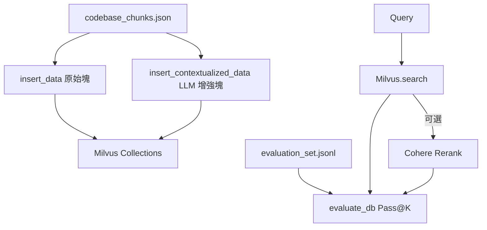

### 總覽
以 Milvus 落地 Contextual Retrieval：支持標準/上下文/重排序三種策略與 Pass@K 深度評估；同時提供集合 Schema、插入流程、檢索與 Cohere 重排閉環，並內置下載評估數據的流程。

### 流程圖

### 分步講解
- 檢索器類：`MilvusContextualRetriever` 封裝連線、集合構建（密集/可選稀疏）、插入原始塊與上下文化塊、檢索與可選重排。
- 上下文化：以 OpenAI Chat Completions 為每個塊注入文檔級上下文，並存為 `contextualized_content`。
- 評估：`evaluate_retrieval` 精確匹配黃金塊計分，輸出 `Pass@K/average_score/total_queries`。
- 實驗矩陣：基線（原始塊）/上下文（增強塊）/上下文+重排 三組對比。

### 關鍵點總結
- **結構化 Schema**：密集向量必備，稀疏向量可選；倒排索引 + IP 距離。
- **公平對比**：同一語料、同一嵌入、同一指標與參數，控制變量。
- **實務建議**：先行小樣本驗證，再擴容全量評測；關注 API 成本。

