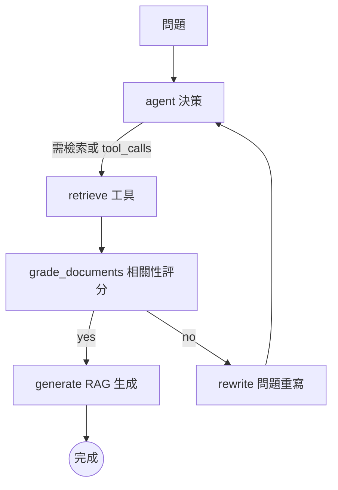

### 總覽
基於 LangGraph 構建 Agentic RAG：Agent 先做決策（是否用檢索工具），檢索後用 LLM 進行相關性評分，根據評分路由到「生成」或「重寫」，形成可觀測的工具使用與自我糾偏閉環。

### 流程圖

### 分步講解
- 檢索工具：`create_retriever_tool(Chroma retriever)` 封裝為工具供 Agent 調用。
- 相關性評分：`ChatOpenAI(gpt-4o).with_structured_output` 返回 `yes/no` 作為路由條件。
- 工作流：`StateGraph` 節點 `agent/retrieve/grade/rewrite/generate` 與條件邊組成可視流程。

### 關鍵點總結
- **工具優先**：Agent 內部先做工具決策，降低盲答概率。
- **自我糾偏**：不相關 → 重寫 → 再檢索，直到生成或退出。
- **易擴展**：可加入網路搜索、重排序、壓縮等節點。

