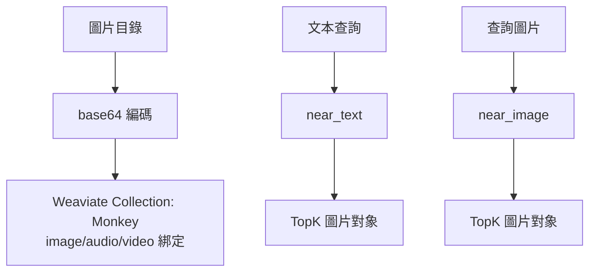

### 總覽
使用 Weaviate 的 `multi2vec_bind` 向量器構建多模態集合，演示圖片入庫、文本檢索、以圖搜圖等能力，支援後續擴展音頻/視頻字段。

### 流程圖

### 分步講解
- 集合：`Vectorizer.multi2vec_bind(image_fields=["image"])` 綁定多模態字段。
- 入庫：圖片轉 base64 作為屬性插入；可擴展 audio/video。
- 檢索：`near_text` 與 `near_image`；回傳 `name/path/mediaType`。

### 關鍵點總結
- **同庫多模態**：同一集合內支持多媒體字段的向量化與檢索。
- **擴展容易**：開啟音頻/視頻只需綁定對應字段與寫入資料。

