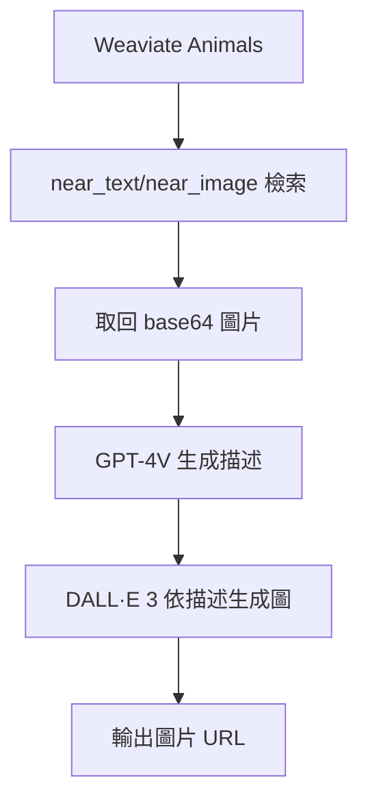

### 總覽
多模態 RAG 範例：以 Weaviate 檢索圖片，並用 GPT-4V 生成圖片描述，再用 DALL·E 3 依據描述合成新圖，構建「檢索 → 理解 → 生成」閉環。

### 流程圖

### 分步講解
- 集合：`multi2vec_bind` 綁定 image/audio/video；本例使用 image。
- 檢索：按文本過濾 `mediaType=image`，取回圖像 base64。
- 理解：以 `gpt-4-vision-preview` 對 `image_url(data:image/jpeg;base64,...)` 生成描述。
- 生成：用 `images.generate(model="dall-e-3")` 生成新圖 URL。

### 關鍵點總結
- **閉環**：多模態檢索 + 多模態理解 + 文生圖合成。
- **安全與成本**：注意 API Key 管理與圖片隱私、費用控制。

