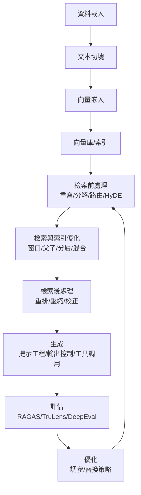

### 目標
用最小代價建立一條從「閱讀→理解→驗證→評估→優化」的後端學習閉環。你將依優先級逐步查看本倉庫代碼，掌握核心邏輯與常見算法後，能夠度量效果並自我優化。

### 全局閉環（一眼看懂）


### 優先級與路線圖（按序完成）
1) 建立最小心智模型（15–30 分鐘）
   - 先讀：
     - `00-简单RAG-SimpleRAG/01_01_LlamaIndex_5行代码.py`
     - `00-简单RAG-SimpleRAG/03_LangChain_LCEL_RAG_v1.py`
   - 看點：5 行跑通 RAG；理解「索引→檢索→生成」最短路。
   - 驗收：能口述資料→索引→檢索→生成的資料流與關鍵物件。

2) 資料與切塊（30–45 分鐘）
   - 代碼重點：
     - `01-数据导入-DataLoading/01-简单文本读取/` 下任一 `.py`
     - `02-文本切块-DocChunking/01-LangChain-CharacterTextSplitter.py`
     - `02-文本切块-DocChunking/03_LlamaIndex-分块大小影响准确性.py`
   - 看點：`chunk_size/chunk_overlap/separators` 如何影響召回和可讀性。
   - 驗收：改動切塊參數，觀察檢索片段的變化（內容密度與連貫）。

3) 向量與向量庫（30–45 分鐘）
   - 代碼重點：
     - `03-向量嵌入-Embedding/04-BGE-M3.py`
     - `04-向量存储-VectorDB/Milvus/a-working-sample.py`
     - `04-向量存储-VectorDB/多模态检索/*`（選讀）
   - 看點：嵌入模型選型（中文、跨模態）；Milvus/Chroma 的基本操作。
   - 驗收：切換嵌入模型（如 BGE ↔ OpenAI），比較語義召回差異。

4) 檢索前處理（45–60 分鐘）
   - 代碼重點：
     - 重寫：`05-检索前处理-PreRetrieval/02-查询翻译/01-查询重写-2-RePhraseQueryRetriever.py`
     - 分解：`05-检索前处理-PreRetrieval/02-查询翻译/02-查询分解-1/2-MultiQueryRetriever.py`
     - HyDE：`05-检索前处理-PreRetrieval/02-查询翻译/04-查询扩展-HyDE假设文档生成.py`
     - 路由：`05-检索前处理-PreRetrieval/03-查询路由/01-逻辑路由.py`
   - 算法速記：
     - RePhrase：降低口語/噪音；MultiQuery：多視角查詢提升覆蓋；HyDE：虛構文檔→更穩健檢索。
   - 驗收：對同一問題，觀察重寫/分解/HyDE 前後檢索候選差異。

5) 索引優化（60–90 分鐘）
   - 代碼重點：
     - 窗口：`06-索引优化-Indexing/01-从小块到大上下文/01-节点句子滑动窗口.py`
     - 父子：`06-索引优化-Indexing/01-从小块到大上下文/02-父子文本块检索.py`
     - 自動合併：`06-索引优化-Indexing/02-构建有层次的索引/04-粗中有细的示例.py`
     - 雙層：`06-索引优化-Indexing/02-构建有层次的索引/02-双层索引-Milvus-成功的分层索引.py`
     - 多表示：`06-索引优化-Indexing/03-构建多表示的索引/02-用MultiVectorRetriever构建多表示索引.py`
   - 算法速記：
     - SentenceWindow/MetadataReplacement：以上下文窗口替換命中節點文本。
     - ParentDocumentRetriever：子塊建索引、父塊輸出。AutoMerging：命中聚合。
   - 驗收：對比「基線 vs 窗口/父子/合併」的回答完整度與可讀性。

6) 檢索後處理（45–60 分鐘）
   - 代碼重點：
     - 重排：`07-检索后处理-PostRetrieval/01-重排/*`（RRF/CrossEncoder/ColBERT/Cohere/RankLLM）
     - 壓縮：`07-检索后处理-PostRetrieval/02-压缩/*`（ContextualCompression/LLMLingua/SEO）
     - 校正：`07-检索后处理-PostRetrieval/03-校正/01-CRAG-反思式检索.py`
   - 算法速記：
     - RRF：score=∑ 1/(rank+k)；CrossEncoder：Q+D 合併編碼精排；ColBERT：token 級後期交互。
   - 驗收：先 RRF，再嘗試 CrossEncoder/RankLLM 精排；觀察 TopN 改變。

7) 生成與輸出控制（45–60 分鐘）
   - 代碼重點：
     - 提示工程：`08-响应生成-Generation/02-通过提示词优化响应/*`
     - 輸出控制：`08-响应生成-Generation/03-通过输出解析控制格式/*`（JSON/Pydantic/Function Calling）
     - 自動優化：`08-响应生成-Generation/04-动态生成优化策略/Self-RAG完整实现.py`
   - 驗收：同題生成對比「模板化/少樣本/路由」；嘗試原生 JSON 與 Pydantic 輸出。

8) 評估與迭代（60–90 分鐘）
   - 代碼重點：
     - RAGAS：`09-系统评估-Evaluation/01-RAGAS.py`
     - TruLens：`09-系统评估-Evaluation/02-Trulens.py`
     - DeepEval：`09-系统评估-Evaluation/03-DeepEval.py`
     - LlamaIndex Eval：`09-系统评估-Evaluation/04-LlamaIndexEvaluation.py`
   - 驗收：為當前管線產出至少 2 個可比較的分數（如忠實度/相關性）。

9) 進階策略（選修）
   - Contextual Retrieval（工程版）：`10-高级RAG-AdvanceRAG/02-ContextRetrieval/*`
   - Agentic/Adaptive RAG：`10-高级RAG-AdvanceRAG/04-AgenticRAG/*`
   - 多模態 RAG：`10-高级RAG-AdvanceRAG/05-MultiModalRAG/*`

### 一步步引導（每步的查看與思考）
- 打開檔案→先掃函數名/類名→尋找「資料流入口」→定位「超參/關鍵參數」→觀察「輸出/日誌」→嘗試一個最小改動→記錄差異。
- 關鍵檢查點：
  - 切塊：`chunk_size/overlap/separators` 與文本特性是否匹配？
  - 嵌入：語言/領域是否匹配？向量維度與索引類型是否匹配？
  - 檢索前：重寫/分解/HyDE 對召回率實際提升？
  - 檢索：TopK/閾值/窗口/父子/合併策略的影響？
  - 重排：RRF 基線 vs CrossEncoder/RankLLM 的精度-成本權衡？
  - 生成：提示模板是否覆蓋「目標/格式/邏輯」？是否需要 Few-Shot？
  - 評估：先固定一套指標，所有改動皆「前後對比」。

### 常用算法速覽（抄寫即可）
- RRF：score(d)=∑ 1/(rank_i(d)+k)；k≈60 常用。
- CrossEncoder：拼接 Q+D，單塔分類頭輸出相似度，精度高成本高。
- ColBERT：Q/D 分別編碼，查詢時計算 MaxSim（token 級），兼顧速度與精度。
- MultiQuery：多視角重寫查詢，增加覆蓋；RePhrase：健壯化口語。
- HyDE：先生成假設文檔，再檢索更穩健的候選。
- ParentDocument/AutoMerging/SentenceWindow：召回用小粒度，輸出補上下文。
- CRAG：檢索評分→不相關則重寫+外搜→再生成。

### 反覆優化模板（每輪 30–60 分鐘）
1. 設定本輪目標（如：提高忠實度 5%）
2. 鎖定單一變量（如：切塊、檢索前策略、重排器、模板）
3. A/B 比較（固定其他條件）
4. 產出評估報告（RAGAS/TruLens 任一）
5. 歸檔結論與下一步假設

### 壞味道提醒（看到就修）
- 「資料泥團」：散落多處的相同參數未集中管理（如 TopK、chunk）。
- 「晦澀」：提示模板無結構要求；生成結果不可解析。
- 「不必要複雜」：未度量就疊策略；先用 RRF/窗口/父子等低成本招數。

---
如需，我可將以上路線拆成 3 天學習計劃（每日 2–3 小時）與檢核表，幫你穩定完成閉環。

---

## 更詳細的代碼閱讀指南（逐步定位、學什麼、怎麼學）

下列每一步都給出：打開檔案與入口 → 先看什麼 → 跳到哪個函數/類 → 關鍵參數 → 跑起來觀察什麼 → 練習修改什麼。

### 0) 從「5 行代碼」完整走讀（逐行註解與擴展）
- 檔案：`00-简单RAG-SimpleRAG/01_01_LlamaIndex_5行代码.py`

```python
from llama_index.core import VectorStoreIndex, SimpleDirectoryReader  # 1. 匯入兩個核心類型：
# - SimpleDirectoryReader: 將文件讀成 LlamaIndex 的 Document 物件（含 text/metadata）
# - VectorStoreIndex: 對 Document 建立向量索引（預設使用全局 Settings 的嵌入與分塊器）

documents = SimpleDirectoryReader(input_files=["90-文档-Data/黑悟空/设定.txt"]).load_data()  # 2. 載入文本文件，返回 List[Document]
# 可觀察點：print(type(documents[0]), documents[0].metadata, documents[0].get_content()[:120])

index = VectorStoreIndex.from_documents(documents)  # 3. 直接建索引（內部：切塊→嵌入→入庫到默認向量存儲）
# 擴展思考：如何替換嵌入模型/切塊器？（見 Settings 或傳參）

query_engine = index.as_query_engine()  # 4. 取得查詢引擎（預設 similarity_top_k=2，response_mode=compact）
# 可觀察點：query_engine 的可配置參數，如 similarity_top_k/response_mode/node_postprocessors

print(query_engine.query("黑神话悟空中有哪些战斗工具?"))  # 5. 提問→檢索→生成
# 可觀察點：response.source_nodes（命中片段），判斷回答是否引用恰當文本
```

- 立刻練習：
  1) 打印 `response.source_nodes`：
     ```python
     resp = query_engine.query("黑神话悟空中有哪些战斗工具?")
     for i, sn in enumerate(resp.source_nodes, 1):
         print(i, sn.score, sn.node.text[:120])
     ```
  2) 改大 `similarity_top_k`：
     ```python
     query_engine = index.as_query_engine(similarity_top_k=5)
     ```
  3) 指定「窗口替換」以提升可讀性（參考 06-索引优化 對應程式）：
     ```python
     from llama_index.core.postprocessor import MetadataReplacementPostProcessor
     qe = index.as_query_engine(similarity_top_k=2,
                                node_postprocessors=[MetadataReplacementPostProcessor(target_metadata_key="window")])
     print(qe.query("黑神话悟空中有哪些战斗工具?"))
     ```

### 1) 最小心智模型（Simple RAG）
- 打開檔案與入口：
  - `00-简单RAG-SimpleRAG/01_01_LlamaIndex_5行代码.py`
  - `00-简单RAG-SimpleRAG/03_LangChain_LCEL_RAG_v1.py`
- 先看什麼：
  - LlamaIndex/LCEL 的最短鏈路：Document → Index → QueryEngine → .query/.invoke
- 跳到哪裡：
  - LlamaIndex 的 `VectorStoreIndex.from_documents` 與 `index.as_query_engine`
  - LCEL 的「管線運算符」：`prompt | llm | parser`
- 關鍵參數：
  - `similarity_top_k`、`temperature`、`max_tokens`
- 跑起來觀察：
  - source_nodes（命中文段）是否與回答一致
- 練習修改：
  - 把 `similarity_top_k` 從 2 調到 5，比較回答引用的片段差異。

### 2) 資料與切塊
- 打開：
  - `01-数据导入-DataLoading/01-简单文本读取/01-用LangChain读入txt文件.py`
  - `02-文本切块-DocChunking/01-LangChain-CharacterTextSplitter.py`
- 先看：
  - `CharacterTextSplitter` 與 `RecursiveCharacterTextSplitter`
- 跳到：
  - `split_documents(...)` 回傳的 `Document.page_content` 長度、邊界
- 關鍵參數：
  - `chunk_size`、`chunk_overlap`、`separators`
- 觀察：
  - 切塊之後的內容邊界是否落在語義自然斷點
- 練習：
  - 對同一文本嘗試 `chunk_size=300/500/800`，在後續檢索中對比 Top1 片段可讀性。

### 3) 向量與向量庫（Chroma/Milvus）
- 打開：
  - `03-向量嵌入-Embedding/04-BGE-M3.py`
  - `04-向量存储-VectorDB/Milvus/a-working-sample.py`
- 先看：
  - 嵌入模型初始化與向量維度；Milvus/Chroma 建庫、插入、檢索 API
- 跳到：
  - Chroma：`Chroma.from_documents(...).as_retriever()`
  - Milvus：`create_collection/create_index/search`
- 關鍵參數：
  - 向量維度、`metric_type`（COSINE/IP/L2）、`nprobe`/`nlist`
- 觀察：
  - 換嵌入模型（OpenAI ↔ BGE）後召回結果語義差異
- 練習：
  - 對 Milvus 調整 `IVF_FLAT` 的 `nlist/nprobe`，驗證延遲與精度變化。

### 4) 檢索前處理：重寫/分解/HyDE/路由
- 打開：
  - `05-检索前处理-PreRetrieval/02-查询翻译/01-查询重写-2-RePhraseQueryRetriever.py`
  - `05-检索前处理-PreRetrieval/02-查询翻译/02-查询分解-1-MultiQueryRetriever.py`
  - `05-检索前处理-PreRetrieval/02-查询翻译/04-查询扩展-HyDE假设文档生成.py`
  - `05-检索前处理-PreRetrieval/03-查询路由/01-逻辑路由.py`
- 先看：
  - `.from_llm(...)` 的構造；生成查詢列表/假設文檔的提示模板
- 跳到：
  - `RePhraseQueryRetriever`、`MultiQueryRetriever.from_llm`、`HyDE生成鏈`、`with_structured_output(RouteQuery)`
- 關鍵參數：
  - 產生查詢數量、溫度；提示模板的角度約束
- 觀察：
  - 原始查詢 vs 重寫/分解/HyDE 後的 TopK 重疊度與涵蓋度
- 練習：
  - 為 MultiQuery 自訂 `PromptTemplate`，要求從「流程/策略/裝備」三個維度各給 1 條。

### 5) 索引優化：窗口/父子/合併/雙層/多表示
- 打開：
  - `06-索引优化-Indexing/01-从小块到大上下文/01-节点句子滑动窗口.py`
  - `06-索引优化-Indexing/01-从小块到大上下文/02-父子文本块检索.py`
  - `06-索引优化-Indexing/02-构建有层次的索引/04-粗中有细的示例.py`
  - `06-索引优化-Indexing/02-构建有层次的索引/02-双层索引-Milvus-成功的分层索引.py`
  - `06-索引优化-Indexing/03-构建多表示的索引/02-用MultiVectorRetriever构建多表示索引.py`
- 先看：
  - 節點生成與 `node_postprocessors`；IndexNode 與遞歸檢索器的路由映射
- 跳到：
  - `SentenceWindowNodeParser` + `MetadataReplacementPostProcessor`
  - `ParentDocumentRetriever(child_splitter/parent_splitter)`
  - `AutoMergingRetriever(base_retriever, storage_context)`
  - `RecursiveRetriever(query_engine_dict=...)`
- 關鍵參數：
  - `window_size`、`num_nodes`、父/子 `chunk_size`、`similarity_top_k`
- 觀察：
  - 回答是否更完整且上下文連貫；source_nodes 命中是否更貼近語義
- 練習：
  - 在父子檢索中切換父/子 `chunk_size` 比例（如 1000/200 ↔ 1500/300）。

### 6) 檢索後處理：重排/壓縮/校正
- 打開：
  - `07-检索后处理-PostRetrieval/01-重排/01-RRF重排.py`
  - `07-检索后处理-PostRetrieval/01-重排/02-CrossEncoder重排.py`
  - `07-检索后处理-PostRetrieval/02-压缩/01-ContextualCompressionRetriever压缩.py`
  - `07-检索后处理-PostRetrieval/03-校正/01-CRAG-反思式检索.py`
- 先看：
  - RRF 分數計算；CrossEncoder 的 tokenizer + model；ContextualCompression 組合 retriever+compressor；CRAG 的狀態機
- 跳到：
  - `reciprocal_rank_fusion(results, k)` 的累積分數邏輯
  - `AutoModelForSequenceClassification` 前向計分
  - `ContextualCompressionRetriever(base_compressor=..., base_retriever=...)`
  - CRAG：`grade_documents/transform_query/web_search/generate` 節點與條件邊
- 關鍵參數：
  - RRF 的 `k`、CrossEncoder 的 `max_length`、壓縮器 `top_n`
- 觀察：
  - RRF 前後 TopN 是否穩定提升；CrossEncoder 精排後答案是否更貼題
- 練習：
  - 先用 RRF → 再接 CrossEncoder；對比只用其一的差異。

### 7) 生成與輸出控制：模板/少樣本/JSON/Pydantic/工具
- 打開：
  - `08-响应生成-Generation/02-通过提示词优化响应/*`
  - `08-响应生成-Generation/03-通过输出解析控制格式/*`
  - `08-响应生成-Generation/04-动态生成优化策略/Self-RAG完整实现.py`
- 先看：
  - Prompt 結構化欄位；Few-shot 模板對齊；`response_format={'type': 'json_object'}`；`OpenAIPydanticProgram`
- 跳到：
  - `PromptTemplate`/`ChatPromptTemplate`、`JsonOutputParser`
  - `with_structured_output(...)` / Pydantic v2 Program 的 `output_cls`
  - Function/Tool Calling 的 `tools`/`bind_tools`
- 關鍵參數：
  - 溫度與 `max_new_tokens`、示例個數、JSON schema 欄位
- 觀察：
  - 原生 JSON 與 Pydantic 直出的結構一致性與健壯性
- 練習：
  - 把一個自由文本回覆改為 JSON（加 schema 校驗），再改為 Pydantic 直出。

### 8) 評估與迭代：RAGAS/TruLens/DeepEval/LlamaIndex Eval
- 打開：
  - `09-系统评估-Evaluation/01-RAGAS.py`、`02-Trulens.py`、`03-DeepEval.py`、`04-LlamaIndexEvaluation.py`
- 先看：
  - 指標定義與最小可運行樣例
- 跳到：
  - RAGAS：`Faithfulness/AnswerRelevancy` 與 `LangchainLLMWrapper`
  - TruLens：`@instrument`、`Feedback(...).on(...).on_output()`、`get_leaderboard()`
  - LlamaIndex：`BatchEvalRunner(...).aevaluate_responses`
- 關鍵參數：
  - 評估集大小、指標閾值、是否啟用 CoT 理由
- 觀察：
  - 固定一版 pipeline，記錄 2 項以上分數做基準；每次改動都對比
- 練習：
  - 在 LlamaIndex Eval 中比較「窗口檢索 vs 基線檢索」四項指標表。

---

## 最小實驗組合（6 套，從易到難）
1. 基線：Chroma 向量檢索 + 模板化生成 + RAGAS 忠實度
2. +RRF：多查詢 + 向量檢索 + RRF 融合
3. +窗口：SentenceWindow + MetadataReplacement（對比可讀性）
4. +CrossEncoder：基於 2 的候選再精排（精度↑）
5. +Contextual：上下文化節點 vs 原始節點（MRR/HitRate）
6. +CRAG：檢索評分→必要時重寫+外搜→生成

## 調試與斷點建議
- LangChain/LCEL：在 `.invoke(...)` 前後打印或設斷點觀察輸入/輸出。
- Rerank：打印初始 TopK 與重排 TopK 的差異列表。
- LlamaIndex：觀察 `response.source_nodes` 的 `score/metadata/text`。

## 觀測與度量（每輪都記錄）
- 檢索：Recall@K / HitRate / MRR
- 生成：Faithfulness / Answer Relevancy / Hallucination 率
- 成本：Token、延遲（P95）、API 調用次數

## 常見坑（快速檢核）
- 嵌入模型與語料語言/領域不匹配 → 召回差
- 切塊過大或過小 → 要麼失真，要麼碎片化嚴重
- 重排器閾值/TopN 過大 → 成本暴增，收益遞減
- JSON/結構化輸出無校驗 → 前端/下游解析易崩


